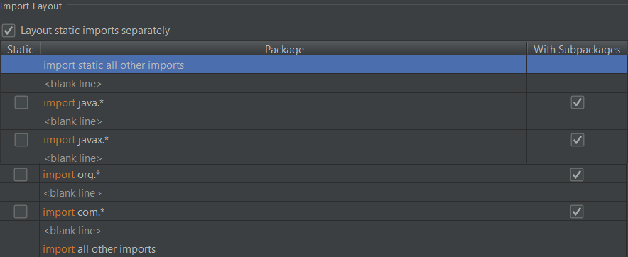
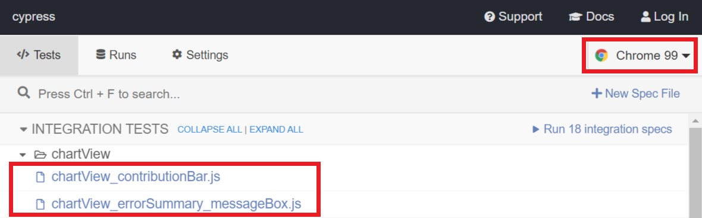
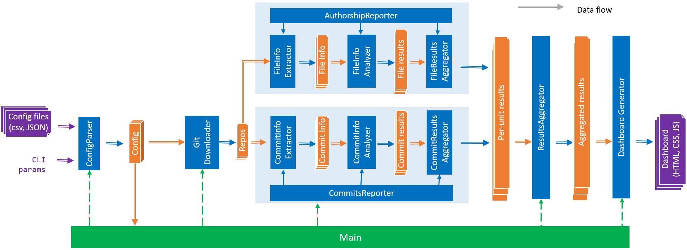
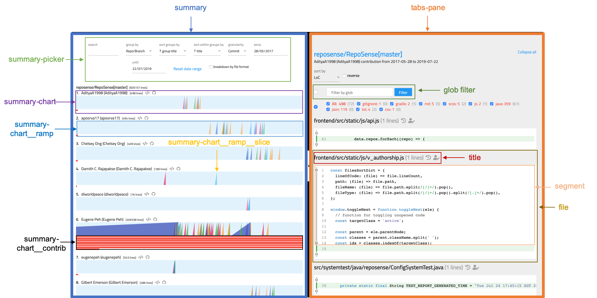
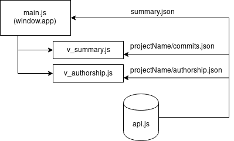
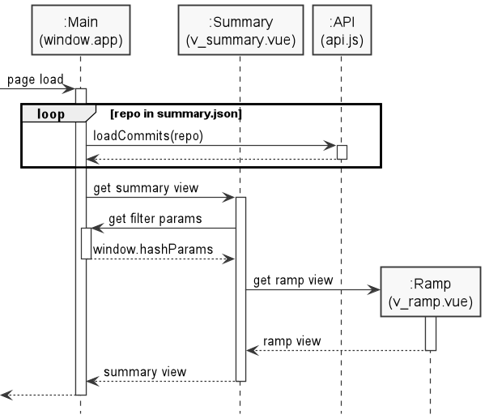
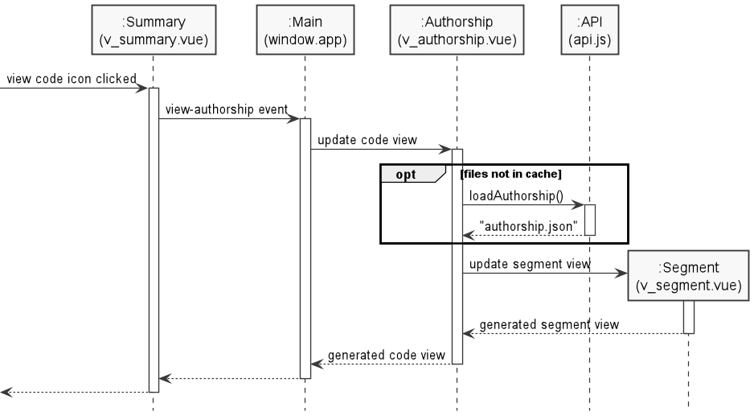

# RepoSense - Developer Guide
Thank you for your interest in contributing to RepoSense!
- [Setting up](#setting-up)
  - [Prerequisites](#prerequisites)
  - [Setting up the project in your computer using IntelliJ](#setting-up-the-project-in-your-computer-using-intellij)
  - [Verifying the setup](#verifying-the-setup)
  - [Configuring the Java coding style](#configuring-the-java-coding-style)
  - [Configuring the JavaScript coding style](#configuring-the-javascript-coding-style)
  - [Configuring Cypress for automated front-end testing](#configuring-cypress-for-automated-front-end-testing)
- [Architecture](#architecture)
  - [Parser](#parserconfigparser)
  - [Git](#git)
  - [CommitsReporter](#commitsreporter)
  - [AuthorshipReporter](#authorshipreporter)
  - [ReportGenerator](#reportgeneratormain)
  - [System](#system)
  - [Model](#model)
- [HTML Report](#html-report)
  - [Report Architecture](#report-architecture)
  - [Javascript Files](#javascript-files)
  - [JSON Report Files](#json-report-files)
  - [Main](#main-mainjs)
  - [Data loader](#data-loader-apijs)
  - [Summary View](#summary-view-v_summaryjs)
  - [Authorship View](#authorship-view-v_authorshipjs)

## Setting up

### Prerequisites
1. **JDK `1.8.0_60`** or later.
1. **git `2.14`** or later on the command line.
 > Type `git --version` on your OS terminal and ensure that you have the correct version of **git**.

### Setting up the project in your computer using IntelliJ
1. Fork this repo, and clone the fork to your computer.
1. Open *IntelliJ* (if you are not in the welcome screen, click `File` > `Close Project` to close the existing project dialog first).
1. Set up the correct *JDK* version for *Gradle*.
    1. Click `Configure` > `Project Defaults` > `Project Structure`.
    1. Click `New…​` and find the directory of the *JDK*.
1. Click `Import Project`.
1. Locate the `build.gradle` file and select it. Click `OK`.
1. Ensure that the selected version of `Gradle JVM` matches our prerequisite.
1. Click `OK` to accept the all the other default settings.

### Verifying the setup
1. Ensure that *Gradle* builds without error by running the command `gradlew clean build`, and ensure that it finishs with a `BUILD SUCCESSFUL` message.
1. Run the tests to ensure that they all pass by running the command `gradlew test systemtest`, and ensure that it finishs with a `BUILD SUCCESSFUL` message.
  > Ensure that you are on the project root directory when using the `gradlew` commands.

### Configuring the Java coding style
This project follows [oss-generic coding standards](https://oss-generic.github.io/process/docs/CodingStandards.html). *IntelliJ’s* default style is mostly compliant with our *Java* coding convention but it uses a different import order from ours. To rectify,

1. Go to `File` > `Settings…`​ (*Windows/Linux*), or `IntelliJ IDEA` > `Preferences…`​ (*macOS*).
1. Select `Editor` > `Code Style` > `Java`.
1. Click on the `Imports` tab to set the order
   * For `Class count to use import with '*'` and `Names count to use static import with '*'`: Set to `999` to prevent IntelliJ from contracting the import statements
   * For `Import Layout`, follow this image below:
   

Optionally, you can follow the [Using Checkstyle](UsingCheckstyle.md) document to configure *Intellij* to check style-compliance as you write code.

### Configuring the JavaScript coding style
Our project follows the [Airbnb Javascript Style Guide](https://github.com/airbnb/javascript), the eslint configuration file is available at the root of the project. Please run a `npm run lint -- --fix frontend/src/**/*js` from the project root directory and fix all of the eslint errors before committing your code for final review.

Eslint and its accompaning modules can be installed through NPM, so do ensure that you got it [installed](https://www.npmjs.com/get-npm) if you are working on the report.

### Configuring Cypress for automated front-end testing
We use [Cypress](https://www.cypress.io/) for automated end-to-end front-end testing. <br/>

#### To write tests
1. Create a new test file in `frontend/cypress/tests`
1. At project root start *Cypress Test Runner* by running `gradlew cypress`
1. On the top right hand corner, set `Chrome` as the default browser
1. Under **Integration Tests**, click on the newly created test file to run it


> Read [Cypress's Documentation](https://docs.cypress.io/api/commands/document.html#Syntax) to familiarize yourself with its syntax and [Cypress's debugging guide](https://docs.cypress.io/guides/guides/debugging.html#Log-Cypress-events) to tackle problems with your tests.

#### To run all tests locally
1.  At project root, run `gradlew frontendTest`
> If you encountered an invalid browser error, please ensure that you have `Chrome` installed in the default installation directory. Otherwise, follow the instructions [here](https://docs.cypress.io/guides/guides/debugging.html#Launching-browsers) to create symbolic links so Cypress can locate `Chrome` in your system.

### Before writing code
1. Do check out our [process guide](../docs/Process.md) before submitting any PR with your changes.

### Building and running RepoSense from code

1. Execute the following command on the OS terminal inside the project directory. <br/>
Usage: `gradlew run -Dargs="([--config CONFIG_FOLDER] | [--repos REPO_PATH_OR_URL...]) [--view [REPORT_FOLDER]] [--output OUTPUT_DIRECTORY] [--since DD/MM/YYYY] [--until DD/MM/YYYY] [--formats FORMAT...] [--ignore-standalone-config] [--timezone ZONE_ID[±hh[mm]]]"` <br/>
Named Arguments: 
```
--help, -h           Show help message.
--version, -V        Show the version of RepoSense.
--view [PATH], -v [PATH]
                     Starts a server to display the report in the
                     provided directory. If used as a flag (with no
                     argument), generates a report and automatically
                     displays the report.
--output PATH, -o PATH
                     The directory to output the report folder,
                     reposense-report. If not provided, the report
                     folder will be created in the current working
                     directory.
--since dd/MM/yyyy, -s dd/MM/yyyy
                     The date to start filtering.
--until dd/MM/yyyy, -u dd/MM/yyyy
                     The date to stop filtering.
--formats [FORMAT [FORMAT ...]], -f [FORMAT [FORMAT ...]]
                     The alphanumeric file formats to process.
                     If not provided, default file formats will be
                     used.
                     Please refer to userguide for more information.
--ignore-standalone-config, -i
                     A flag to ignore the standalone config file in
                     the repo.
--timezone ZONE_ID[±hh[mm]], -t ZONE_ID[±hh[mm]]
                     The timezone to use for the generated report. 
                     One kind of valid timezones is relative to UTC. 
                     E.g. UTC, UTC+08, UTC-1030.
                     If not provided, system default timezone will be used.
--config PATH, -c PATH
                     The directory containing the config files. If not
                     provided, the config files will be obtained from
                     the current working directory.
--repo LOCATION [LOCATION ...], --repos LOCATION [LOCATION ...], -r LOCATION [LOCATION ...]
                     The GitHub URL or disk locations to clone repository.
```

Sample usage to generate the report with no specify arguments: (find and use config files in current working directory)
```
gradlew run
```

Sample usage to generate the report with config files and automatically open the report:
```
gradlew run -Dargs="--config ./configs/ --output output_path/ --since 21/10/2017 --until 21/11/2017 --formats java adoc js --view"
```

Sample usage to generate the report with config files and choose the timezone used to be UTC+8:
```
gradlew run -Dargs="--config ./configs/ --output output_path/ --timezone UTC+08"
```

Sample usage to generate the report with repository locations and automatically open the report:
```
gradlew run -Dargs="--repos https://github.com/reposense/RepoSense.git https://github.com/se-edu/collate.git --output output_path/ --since 21/10/2017 --until 21/11/2017 --formats java adoc js --view"
```

Sample usage to generate the report with repository locations but ignore the standalone config file:
```
gradlew run -Dargs="--repos https://github.com/reposense/RepoSense.git https://github.com/se-edu/collate.git --ignore-standalone-config"
```

Sample usage to view the report:
```
gradlew run -Dargs="--view output_path/reposense-report"
```

Sample usage to generate the report with config files using the alias of argument:
```
gradlew run -Dargs="-c ./configs/ -o output_path/ -s 21/10/2017 -u 21/11/2017 -f java adoc js"
```

`-Dargs="..."` uses the same argument format as mentioned above.

## Architecture

 
*Figure 1. Overall architecture of RepoSense*

### Parser(ConfigParser)
`Parser` contains two classes:
 * [`ArgsParser`](/src/main/java/reposense/parser/ArgsParser.java): Parses the user-supplied command line arguments into a `CliArguments` object.
 * [`CsvParser`](/src/main/java/reposense/parser/CsvParser.java): Parses the the user-supplied CSV config file into a list of `RepoConfiguration` for each repository to analyze.


### Git
`Git` package contains the wrapper classes for respective *git* commands.
 * [`GitBlame`](/src/main/java/reposense/git/GitBlame.java): Wrapper class for `git blame` functionality. Traces the revision and author last modified each line of a file.
 * [`GitBranch`](/src/main/java/reposense/git/GitBranch.java): Wrapper class for `git branch` functionality. Gets the name of the working branch of the target repo.
 * [`GitCheckout`](/src/main/java/reposense/git/GitCheckout.java): Wrapper class for `git checkout` functionality. Checks out the repository by branch name or commit hash.
 * [`GitClone`](/src/main/java/reposense/git/GitClone.java): Wrapper class for `git clone` functionality. Clones the repository from *GitHub* into a temporary folder in order to run the analysis.
 * [`GitDiff`](/src/main/java/reposense/git/GitDiff.java): Wrapper class for `git diff` functionality. Obtains the changes between commits.
 * [`GitLog`](/src/main/java/reposense/git/GitLog.java): Wrapper class for `git log` functionality. Obtains the commit logs and the authors' info.
 * [`GitRevList`](/src/main/java/reposense/git/GitRevList.java): Wrapper class for `git rev-list` functionality. Retrieves the commit objects in reverse chronological order.
 * [`GitShortlog`](/src/main/java/reposense/git/GitShortlog.java): Wrapper class for `git shortlog` functionality. Obtains the list of authors who have contributed to the target repo.


### CommitsReporter
[`CommitsReporter`](/src/main/java/reposense/commits/CommitsReporter.java) is responsible for analyzing the **commit** history and generating a [`CommitContributionSummary`](/src/main/java/reposense/commits/model/CommitContributionSummary.java) for each repository. `CommitContributionSummary` contains information such as each author's daily and weekly contribution and the variance of their contribution. `CommitsReporter`,
 1. uses [`CommitInfoExtractor`](/src/main/java/reposense/commits/CommitInfoExtractor.java) to run the `git log` command, which generates the statistics of each commit made within date range.
 1. generates a [`CommitInfo`](/src/main/java/reposense/commits/model/CommitInfo.java) for each commit, which contains the `infoLine` and `statLine`.
 1. uses [`CommitInfoAnalyzer`](/src/main/java/reposense/commits/CommitInfoAnalyzer.java) to extract the relevant data from `CommitInfo` into a [`CommitResult`](/src/main/java/reposense/commits/model/CommitResult.java), such as the number of line insertions and deletions in the commit and the author of the commit.
 1. uses [`CommitResultAggregator`](/src/main/java/reposense/commits/CommitResultAggregator.java) to aggregate all `CommitResult` into a [`CommitContributionSummary`](/src/main/java/reposense/commits/model/CommitContributionSummary.java).


### AuthorshipReporter
[`AuthorshipReporter`](/src/main/java/reposense/authorship/AuthorshipReporter.java) is responsible for analyzing the white listed **files**, traces the original author for each line of text/code, and generating an [`AuthorshipSummary`](/src/main/java/reposense/authorship/model/AuthorshipSummary.java) for each repository. `AuthorshipSummary` contains the analysis results of the white listed files and the amount of line contributions each author made. `AuthorshipReporter`,
 1. uses [`FileInfoExtractor`](/src/main/java/reposense/authorship/FileInfoExtractor.java) to traverse the repository to find all relevant files.
 1. generates a [`FileInfo`](/src/main/java/reposense/authorship/model/FileInfo.java) for each relevant file, which contains the path to the file and a list of [`LineInfo`](/src/main/java/reposense/authorship/model/LineInfo.java) representing each line of the file.
 1. uses [`FileInfoAnalyzer`](/src/main/java/reposense/authorship/FileInfoAnalyzer.java) to analyze each file, using `git blame` or annotations, and finds the `Author` for each `LineInfo`.
 1. generates a [`FileResult`](/src/main/java/reposense/authorship/model/FileResult.java) for each file, which consolidates the authorship results into a *Map* of each author's line contribution to the file.
 1. uses [`FileResultAggregator`](/src/main/java/reposense/authorship/FileResultAggregator.java) to aggregate all `FileResult` into an `AuthorshipSummary`.


### ReportGenerator(Main)
[`ReportGenerator`](/src/main/java/reposense/report/ReportGenerator.java),
 1. uses `GitDownloader` API to download the repository from *GitHub*.
 1. copies the template files into the designated output directory.
 1. uses `CommitReporter` and `AuthorshipReporter` to produce the commit and authorship summary respectively.
 1. generates the `JSON` files needed to generate the `HTML` report.


### System
`System` contains the classes that interact with the Operating System and external processes.
 * [`CommandRunner`](/src/main/java/reposense/system/CommandRunner.java) creates processes that executes commands on the terminal. It consists of many *git* commands.
 * [`LogsManager`](/src/main/java/reposense/system/LogsManager.java) uses the `java.util.logging` package for logging. The `LogsManager` class is used to manage the logging levels and logging destinations. Log messages are output through: `Console` and to a `.log` file.
 * [`ReportServer`](/src/main/java/reposense/system/ReportServer.java) starts a server to display the report on the browser. It depends on the `net.freeutils.httpserver` package.


### Model
`Model` holds the data structures that are commonly used by the different aspects of *RepoSense*.
 * [`Author`](/src/main/java/reposense/model/Author.java) stores the `GitHub ID` of an author. Any contributions or commits made by the author, using his/her `GitHub ID` or aliases, will be attributed to the same `Author` object. It is used by `AuthorshipReporter` and `CommitsReporter` to attribute the commit and file contributions to the respective authors.
 * [`CliArguments`](/src/main/java/reposense/model/CliArguments.java) stores the parsed command line arguments supplied by the user. It contains the configuration settings such as the CSV config file to read from, the directory to output the report to, and date range of commits to analyze. These configuration settings are passed into `RepoConfiguration`.
 * [`RepoConfiguration`](/src/main/java/reposense/model/RepoConfiguration.java) stores the configuration information from the CSV config file for a single repository, which are the repository's orgarization, name, branch, list of authors to analyse, date range to analyze commits and files from `CliArguments`.
 These configuration information are used by:
    - `GitDownloader` to determine which repository to download from and which branch to check out to.
    - `AuthorshipReporter` and `CommitsReporter` to determine the range of commits and files to analyze.
    - `ReportGenerator` to determine the directory to output the report.


## HTML Report
The source files for the report is located in [`frontend/src`](../frontend/src) and is built by [spuild](https://github.com/ongspxm/spuild2) before being packaged into the JAR file to be extracted as part of the report.

The main HTML file is generated from [`frontend/src/index.jade`](../frontend/src/index.jade).

[Vue](https://vuejs.org/v2/api/) (pronounced /vjuː/, like view) is a progressive framework for building user interfaces. It is heavily utilized in the report to dynamically update the information in the various views. (Style guide available [here](https://vuejs.org/v2/style-guide/)).



### Report Architecture


The main Vue object (`window.app`) is responsible for the loading of the report (through `summary.json`). Its `repos` attribute is tied to the global `window.REPOS`, and is passed into the various other modules when the information is needed.

`window.app` is broken down into two main parts
- the summary view
- and the tabbed interface

Summary view act as the main report which shows the various calculations. </br>
Tabbed interface is responsible for loading various modules such as authorship to display additional information.

### Javascript Files
- [**main.js**](../frontend/src/static/js/main.js) - main controller that pushes content into different modules
- [**api.js**](../frontend/src/static/js/api.js)- loading and parsing of the report content
- [**v_summary.js**](../frontend/src/static/js/v_summary.js) - module that supports the ramp chart view
- [**v_authorship.js**](../frontend/src/static/js/v_authorship.js) - module that supports the authorship view

### JSON Report Files
- **summary.json** - a list of all the repositories and their respective details
- **projName/commits.json** - contains information of the users' commits information (e.g. line deletion, insertion, etc), grouped by date
- **projName/authorship.json** - contains information from git blame, detailing the author of each line for all the processed files

### Main (main.js)
This contains the logic for main VueJS object, `window.app`, which is responsible for passing the necessary data into the relevant modules to be loaded.

`v_summary` and `v_authorship` are components which will be embedded into report and will render the corresponding content based on the data passed into it from the main `window.app`.

#### Loading of report information
The main Vue object depends on the `summary.json` data to determine the right `commits.json` files to load into memory. This is handled by `api.js` which loads the relevant file information from the network files if it is available, otherwise a report archive, `archive.zip`, have to be used.

Once the relevant `commit.json` files are loaded, all the repo information will be passed into `v_summary` to be loaded in the summary view as the relevant ramp charts.

#### Activating additional view modules
Most activity or actions should happen within the module itself, but in the case where there is a need to spawn or alter the view of another module, an event is emitted from the first module to the main Vue object (`window.app`), which then handles the data received and passes it along to the relevant modules.

#### Hash link
Other than the global main Vue object, another global variable we have is the `window.hashParams`. This object is reponsible for generating the relevant permalink for a specific view of the summary module for the report.

### Data loader (api.js)
This is the module that is in charged of loading and parsing the data files generated as part of the report.

#### Loading from ZIP file
Due to security design, most modern browsers (e.g. Chrome) do not allow web pages to obtain local files using the directory alone. As such, a ZIP archive of the report information will be produced alongside the report generation.

This archive will be used in place of the network files to load information into the report, in the case when the network files are unavailable.

The API module will be handling all request for all the JSON data files. If the network file is not available, the files will be obtained from the zip archive provided.

#### Retrieving and parsing information
After the JSON files are loaded from their respective sources, the data will be parsed as objects and included inside the global storage object, `window.REPOS`,  in the right format.

For the basic skeleton of `window.REPOS`, refer to the generated `summary.json` file in the report for more details.

### Summary View (v_summary.js)
The `v_summary` module is in charge of loading the ramp charts from the corresponding `commits.json`.



#### Initializing the data for the ramp charts
The summary module is activated after the information is loaded from the main Vue.JS object. At creation, the `repo` attribute is populated with the `window.REPOS` object, which contains information loaded from `summary.json`.

#### Filtering users and repositories
The commits information is retrieved from the corresponding project folders for each repository. These information will be filtered and sorted before passed into the template to be displayed as ramp charts.

#### Padding for dates
For ramps between the date ranges, the slices will be selected and it will be pre and post padded with empty slices to align the ramp slice between the `sinceDate` and `untilDate`. The ramps will then be rendered with the slices in the right position.

### Authorship View (v_authorship.js)
The authorship module retrieves the relevant information from the corresponding `authorship.json` file if it is not yet loaded. If it has been loaded, the data will be written into `window.REPOS` and be read from there instead.



#### Showing relevant information by authors
The files will be filtered, picking only files the selected author has written in. The lines are then split into chunks of "touched" and "untouched" code to be displayed in the tab view which will be popped up on the right side of the screen.
