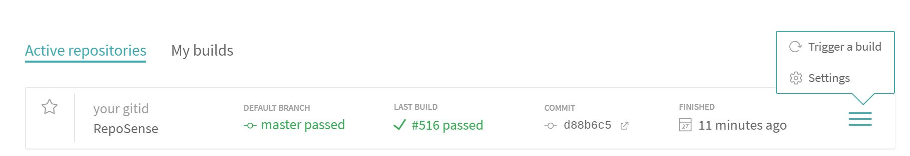
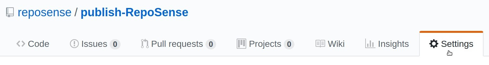
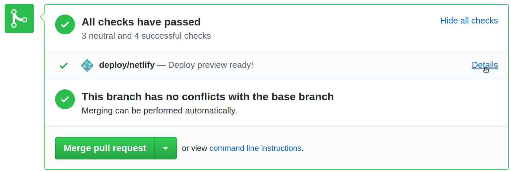

## Automate publishing of your report to GitHub Pages

You can use either [Travis-CI](https://travis-ci.org/) or [GitHub Actions](https://github.com/features/actions) to automate RepoSense report generation and publish the report online to [GitHub Pages](https://pages.github.com/) for free.

### Using Travis

1. Fork publish-RepoSense repository using this [link](https://github.com/RepoSense/publish-RepoSense/fork).
1. Follow this [section](#granting-write-access-to-reposense-for-publishing) to generate a `personal access token` or `deploy key` on GitHub for report publishing. 
1. Sign up and login to [Travis-CI](https://travis-ci.org/).
1. Go to [your account](https://travis-ci.org/account/repositories), click on **Sync account** to fetch all your repositories into Travis-CI.
1. Go to [your publish-RepoSense fork in Travis-CI](https://travis-ci.org/search/publish-RepoSense/), under **Current** tab click on **Activate repository**.
1. In the same page, click on **More options** on the right then access **Settings**:

1. Under **Environment Variables**, name a variable as `GITHUB_TOKEN` or `GITHUB_DEPLOY_KEY` depending on your earlier choice and paste the content that was copied earlier to its value field; then click **Add**. Ensure that the `Display value in build log` is **switched off** for security reasons:

1. Edit [run.sh](../../../../publish-RepoSense/edit/master/run.sh), [repo-config.csv](../../../../publish-RepoSense/edit/master/configs/repo-config.csv) and [author-config.csv](../../../../publish-RepoSense/edit/master/configs/author-config.csv) to customize the command line parameters or repositories to be analyzed. You may read our [User Guide](UserGuide.md#customizing-the-analysis) for more information.
1. To access your site, go to the settings of your fork in GitHub, under **GitHub Pages** section, look for `Your site is published at [LINK]`. It should look something like `https://[YOUR_GITHUB_ID].github.io/publish-RepoSense`.


> The changes made to the configuration files should trigger Travis-CI to generate your report. Otherwise, follow the [next section](#keeping-your-site-up-to-date-with-your-code-contribution) to manually trigger a build. <br/><br/>
It takes a few minutes for report generation. Meanwhile, you can monitor the progress live at [Travis-CI's Builds](https://travis-ci.org/dashboard/builds). <br/>
Try accessing your site again when a green tick appears beside your fork.

### Using GitHub Actions

1. Fork publish-RepoSense repository using this [link](https://github.com/RepoSense/publish-RepoSense/fork).
1. Follow this [section](#granting-write-access-to-reposense-for-publishing) to generate a `personal access token` or `deploy key` on GitHub for report publishing. 
1. Go to the [secrets settings](../../../../publish-RepoSense/settings/secrets) of your publish-RepoSense fork, add a new secret as `ACCESS_TOKEN` or `DEPLOY_KEY` depending on your earlier choice and paste the content that was copied earlier to its value field; then click **Add secret**:

1. Edit [run.sh](../../../../publish-RepoSense/edit/master/run.sh), [repo-config.csv](../../../../publish-RepoSense/edit/master/configs/repo-config.csv) and [author-config.csv](../../../../publish-RepoSense/edit/master/configs/author-config.csv) to customize the command line parameters or repositories to be analyzed. You may read our [User Guide](UserGuide.md#customizing-the-analysis) for more information.
1. To access your site, go to the settings of your fork in GitHub, under **GitHub Pages** section, look for `Your site is published at [LINK]`. It should look something like `https://[YOUR_GITHUB_ID].github.io/publish-RepoSense`.


> The changes made to the configuration files should trigger GitHub Actions to generate your report. Otherwise, follow the [next section](#keeping-your-site-up-to-date-with-your-code-contribution) to manually trigger a build. <br/><br/>
It takes a few minutes for report generation. Meanwhile, you can monitor the progress live at the [actions page](../../../../publish-RepoSense/actions) of your fork. <br/>


### Granting write-access to RepoSense for publishing
We recommmend use of [personal access token](https://github.blog/2013-05-16-personal-api-tokens/) for ease of setup and [deploy key](https://developer.github.com/v3/guides/managing-deploy-keys/#deploy-keys) for enhanced security.

##### If you wish to use `personal access token`:
1. Follow this [guide](https://help.github.com/articles/creating-a-personal-access-token-for-the-command-line/) and give only `public_repo` permission.
1. **Copy** the token for later use.

##### If you wish to use `deploy key`:
> For Windows users, `ssh-keygen` and `base64` are accessible using [`Git Bash`](https://gitforwindows.org/).

1. Use `ssh-keygen` to create a public/private key pair without a passphrase. <br/>
i.e. `ssh-keygen -t ecdsa -b 521 -f id_reposense -q -N ""`
1. Go to the [deploy key settings](../../../../publish-RepoSense/settings/keys) of your publish-RepoSense fork and create a new deploy key with the contents of `id_reposense.pub`.
1. **Copy** the base64 encoded content of the private key for later use. <br/>
i.e. `cat id_reposense | base64 -w 0`

### Keeping your site up-to-date with your code contribution

#### Using Travis

[Travis-CI](https://travis-ci.org/) offers `Cron Jobs` in intervals of daily, weekly or monthly.

1. Login to [Travis-CI](https://travis-ci.org/).
1. Go to [your fork in Travis-CI](https://travis-ci.org/search/publish-RepoSense/), click on **More options** on the right then access **Settings**.
1. Under **Cron Jobs**, choose **master** for `Branch`, **Always run** for `Options` and pick an `Interval` of your choice; then click **Add**:


Alternatively, you can manually trigger an update.

1. Go to [your fork in Travis-CI](https://travis-ci.org/search/publish-RepoSense/), click on **More options** on the right then **Trigger build**.
1. In the pop up, click **Trigger custom build**.

#### Using GitHub Actions

1. Edit [main.yml](../../../../publish-RepoSense/edit/master/.github/workflows/main.yml) and uncomment the `schedule:` section.
1. You may change the expression after `cron:` to a schedule of your choice. Read more about cron syntax [here](https://help.github.com/en/actions/reference/events-that-trigger-workflows#scheduled-events-schedule).
1. Commit your changes.

Alternatively, you can trigger an update by pushing an empty commit to your fork. Currently, the GitHub Actions UI does not support the manual execution of workflows.

### Specifying which version of RepoSense to use

As RepoSense is being actively developed, its master branch is frequently updated with new features and fixes. <br/>
For stablility or familiarity, you may want to use the release. <br/>

#### Use our latest release (Stable)

You can find the changelog of latest release [here](https://github.com/reposense/RepoSense/releases/latest).

Edit line 10 of [run.sh](../../../../publish-RepoSense/edit/master/run.sh) to use `--release`. <br />
```
10   ./get-reposense.py --release
```

#### Use our master branch (Beta)

You can find the list of commits to master branch [here](https://github.com/reposense/RepoSense/commits/master) and planned features/fixes [here](https://github.com/reposense/RepoSense/milestones).

Edit line 10 of [run.sh](../../../../publish-RepoSense/edit/master/run.sh) to use `--master`. <br />
```
10   ./get-reposense.py --master
```
#### Use a specific version of release

Be sure to read and understand [all breaking changes and bugs](https://github.com/reposense/RepoSense/releases) before proceeding.

Edit line 10 of [run.sh](../../../../publish-RepoSense/edit/master/run.sh) to use `--tag TAG`, where `TAG` is the [target version of release](https://github.com/reposense/RepoSense/tags). <br />
```
10   ./get-reposense.py --tag v1.6.1
```
### Managing your configuration files with the help of collaborators

If you use RepoSense to monitor a large number of collaborators, it may be more systematic to have them update their git configurations into your fork using pull-requests.

To ensure that their pull-requests are correct, we can use [Netlify](https://www.netlify.com/) to preview how the changes would look like in production, before deploying them into GitHub Pages.

1. Sign up and login to [Netlify](https://www.netlify.com/).
1. Use this [link](https://app.netlify.com/start) to create a new site.
1. Select **GitHub** as your Git provider and authorize Netlify in the pop up if prompted.
1. If this is your first time using Netlify, pick `publish-RepoSense` when prompted to install Netlify; <br/>
Otherwise, choose `publish-RepoSense` when prompted to link a repository. <br/>
*If you can't find your fork, then Netlify may only have access to selective repositories. <br/>
Click on the link in `Can't see your repo here? Configure the Netlify app on GitHub` to give Netlify access to your fork.*
1. In the next page, leave `master` as the **Branch to deploy**, enter `pip install requests && ./run.sh` for **Build command** and `reposense-report` for **Publish directory**.
1. To save, click on **Deploy site**.
1. To test, go to an open pull-request, scroll down and in `All checks have passed`, click on **Details** beside `deploy/netlify — Deploy preview ready!`, and the report should open in a new tab:

