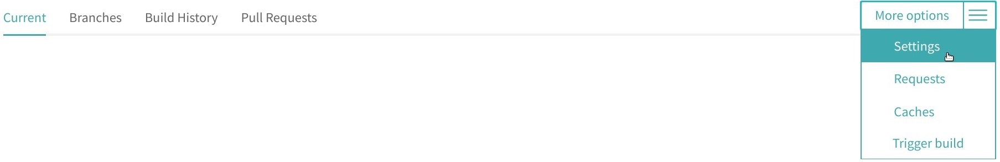

## Publishing your report to GitHub Pages

[GitHub Pages](https://pages.github.com/) enables you to publish your report online for free.

1. Fork this repository using this [link](https://github.com/RepoSense/publish-RepoSense/fork)
1. Follow this [guide](https://help.github.com/articles/creating-a-personal-access-token-for-the-command-line/) to generate a `Personal access token` on GitHub for report publishing  
*Remember to **copy it** and you would **only require** `public_repo` permission*
1. Sign up and login to [Travis-CI](https://travis-ci.org/)
1. Go to [your account](https://travis-ci.org/account/repositories), click on **Sync account** to fetch all your repositories into Travis-CI
1. Go to [your fork in Travis-CI](https://travis-ci.org/search/publish-RepoSense/), under **Current tab** click on **Activate repository**
1. Go to [Travis-CI's Dashboard](https://travis-ci.org/dashboard), find your fork under **Active repositories** and the click on the icon on the right to access its setting

1. Under **Environment Variables**, name a variable as `GITHUB_TOKEN` and paste the `Personal access token` to its value field  
*Ensure that the `Display value in build log` is* **switched off** for security reasons

1. Edit [./run.sh](../../../../publish-RepoSense/edit/master/run.sh), [repo-config.csv](../../../edit/master/configs/repo-config.csv) and [author-config.csv](../../../edit/master/configs/author-config.csv) according to your preferences  
*Read our [User Guide](UserGuide.md#customizing-the-analysis) for more information*
1. To access your site, go to [the setting of your fork](../../../../publish-RepoSense/settings), under **GitHub Pages** look for `Your site is published at [LINK]`

> It takes a few minutes for Travis-CI to generate your report. Meanwhile, you can monitor the progress live at [Travis-CI's Builds](https://travis-ci.org/dashboard/builds).  
  Try accessing your site again when a green tick appears beside your fork.  
  
### Keeping your site updated

[Travis-CI](https://travis-ci.org/) offers `Cron Jobs` in intervals of daily, weekly or monthly.

1. Login to [Travis-CI](https://travis-ci.org/)
1. Go to [Travis-CI's Dashboard](https://travis-ci.org/dashboard) and the click on the icon on the right to access its setting
1. Under **Cron Jobs**, choose **master** for `Branch`, **Always run** for `Options` and pick an `Interval` of your choice; then click Add

Alternatively, you can manually trigger an update.

1. Go to [Travis-CI's Dashboard](https://travis-ci.org/dashboard), find your fork under **Active repositories** and the click on the icon on the right and click on **Trigger a build**
