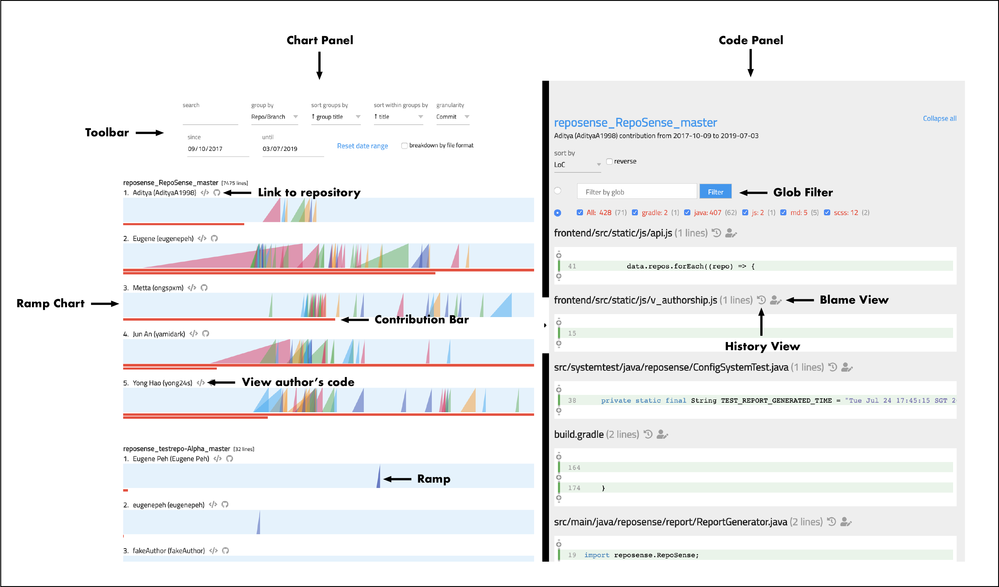
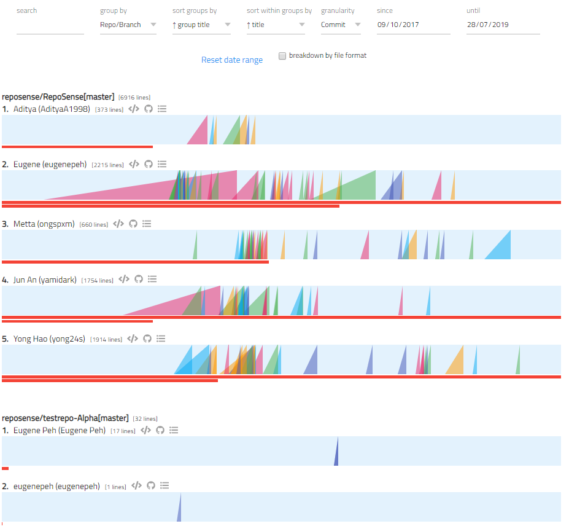

# RepoSense - User Guide

* [Getting Started](#getting-started)
* [Interpreting the Report](#interpreting-the-report)
  * [Chart Panel](#chart-panel)
  * [Code Panel](#code-panel)
  * [Commits Panel](#commits-panel)
  * [Tool Bar](#tool-bar)
* [Configuring a Repo to Provide Additional Data to RepoSense](#configuring-a-repo-to-provide-additional-data-to-reposense)
  * [Provide Data Using a json Config File](#provide-data-using-a-json-config-file)
  * [Provide Data Using `@@author` Tags](#provide-data-using-author-tags)
* [Customizing the Analysis](#customizing-the-analysis)
  * [Customize Using Command Line Parameters](#customize-using-command-line-parameters)
  * [Customize Using csv Config Files](#customize-using-csv-config-files)
    * [`repo-config.csv`](#repo-configcsv)
    * [`author-config.csv`](#author-configcsv)
    * [`group-config.csv`](#group-configcsv)
* [Analyzing Multiple Repos](#analyzing-multiple-repos)
* [Quickstart RepoSense with Netlify](#quickstart-reposense-with-netlify)
* [Using Travis-CI to automate publishing of the report to GitHub Pages](#using-travis-ci-to-automate-publishing-of-the-report-to-github-pages)
* [FAQ](#faq)


## Getting Started

First, ensure that you have the necessary prerequisites:
* **Java 8** (JRE `1.8.0_60`) or later. You may download Java [here](https://www.java.com/en/).
* **git `2.14`** or later on the command line (run `git --version` in your OS terminal to confirm). You may download git [here](https://git-scm.com/downloads).

Next, download the latest executable Jar from our [releases](https://github.com/reposense/RepoSense/releases/latest). Alternatively, you can follow this guide on [Using RepoSense with Netlify](UserGuide.md#using-reposense-with-netlify) which will allow you to use the latest version of RepoSense online without having to download any files.

The simplest use case for RepoSense is to generate a report for the entire history of a repo. Here are the steps:
1. Generate the report for the repo by executing the following command in a terminal:<br/>
   Format : `java -jar RepoSense.jar --repo FULL_REPO_URL` (note the `.git` at the end)<br>
   Example: `java -jar RepoSense.jar --repo https://github.com/reposense/RepoSense.git`
   > Note: The above command will analyze the commits made within one month from the date of report generation. Append `--since d1` if you wish to analyze from the date of the first commit. 
1. The previous step analyzes the default branch of the repo and creates the report in a directory named `reposense-report`. Run the following command to view the report (it will open up in your default Browser):<br/>
   `java -jar RepoSense.jar --view reposense-report`

Alternatively, you can combine the 2 steps by running the following command to generate the report and automatically open it afterwards:<br>
    `java -jar RepoSense.jar --repo FULL_REPO_URL --view`

<hr>

## Interpreting the Report


As the report consist of static pages, it can be viewed using a Web Browser, and can be deployed on most Web hosting platforms (such as [GitHub Pages](https://pages.github.com/)). Assuming the report has been generated already, here are the two options to load the report onto a Browser:
* Run RepoSense with the `--view` option:<br>
  Format: `java -jar RepoSense.jar --view REPORT_FOLDER`<br>
  Example: `java -jar RepoSense.jar --view ./myReport/reposense-report`
* Open the `index.html` (in the report directory) using a Browser and if the report was not loaded automatically, upload the `archive.zip` (in the same directory) manually.


Here is an example of how the report looks like:



It consists of four main parts: the [_Chart Panel_](#chart-panel), the [_Code Panel_](#code-panel), the [_Commits Panel_](#commits-panel), and the [_Tool Bar_](#tool-bar), each of which is explained in the sections below.


### Chart Panel

<br>

The `Chart Panel` (an example is shown above) contains _Ramp Charts_ and _Contribution Bars_.

**Ramp Chart**: This is a visualization of frequency and quantity of contributions of an author for a specific repository.

* **Title**: Each title consists of the **index**, the **name** of the author, number of lines written to the repo, a button to view author's **code**, a button to view author's **repo** and a button to view the **commits** made by the author.
* **Rows**: Each _row_ (i.e., light blue rectangle) represents the contribution timeline of an author for a specific repository.
* **Ramp**: Each row contains **ramps** -- the pointy saw-tooth shapes you see in the screenshot above. A ramp represents the contributions of an author possibly aggregated over a period (e.g., a day or a week).
  * The area of the ramp is proportional to the amount of contribution the author did at that time period.
  * The position of the right edge of the ramp (perpendicular to the blue bar) represents the period (the day or the week) in which the contribution was made.
  * Hover the pointer over a ramp to see the total number of lines represented by that ramp.
  * Click on the ramp to see on GitHub the list of commits represented by that ramp.
* To make comparison between two authors easier, the color of the ramps that represent different authors' contributions at the same time period are the same.
* Ramps representing big contributions can overlap with earlier time periods. This represents the possibility that if the work committed during a specific period is big, it could have started in an earlier time period.

**Contribution Bar**: The total amount of code contributed by an author during the _total analysis period_ is represented by the length of the **red bars** (called _contribution bars_) that appear at the bottom of the row.
* Hover over a contribution bar to see the exact amount of the contribution.
* If an author contributed significantly higher than other authors, the contribution bar can span multiple lines (see the 2nd author in the screenshot for an example).


### Code Panel

The `Code Panel` allows users to see the code attributed to a specific author. Click on the `</>` icon beside the name of the author in the `Chart Panel` to display the `Code Panel` on the right.
* The Code Panel shows the files that contain author's contributions, sorted by the number of lines written.
* Select the radio button to enable one of the following 2 filters. Note that only 1 of the 2 filters is active at any time.
    * Type file path glob in glob filter to include files matching the glob expression.
    * Select the checkboxes to include files of preferred file extensions.
* Clicking the file title toggles the file content.
* Clicking the first icon beside the file title opens the history view of the file on github.
* Clicking the second icon beside the file title opens the blame view of the file on github.
* Code attributed to the author is highlighted in green.
* Non-trivial code segments that are not written by the selected author are hidden by default, but you can toggle them by clicking on the :heavy_plus_sign: icon.

### Commits Panel


The `Commits Panel` allows users to see the commits attributed to a specific author. Hold `Command`&#8984; **(MacOS)** or `Ctrl` **(other OSes)** and click on the ramp chart in the `Chart Panel` to select the time range where you want to display the `Commit Panel` for on the right. <br>


* The `Commits Panel` shows the commits that contain author's contributions.
* The commits can be sorted by the date it was committed or by LoC.
* The tags of the commits will also be displayed on top, if any.
* Clicking on a tag will direct you to the commit having that particular tag.
* The date range for the `Chart Panel` can be updated by clicking on the "Show ramp chart for this period" below the name of the author.
* The ramp slices displayed in the ramp chart for the `Commits Panel` represents individual commits.
* The commit messages body can be expanded or collapsed by clicking on the `...` icon beside each commit message title.
* To promote and encourage the 50/72 rule for commit messages, a dotted border will be shown for:
  * Commit message subject that exceeds 50 characters.
  * Commit message body after the 72nd character mark.

### Tool Bar
The `Tool Bar` at the top provides a set of configuration options that control the Chart Panel.
* `Search` : filters the author and repository by keywords.
  * Multiple keywords/terms can be used, separated by spaces.
  * Entries that contain _any_ (not necessarily _all_) of the search terms will be displayed.
  * The keywords used to filter author and repository are case-insensitive.
* `Group by` : grouping criteria for the rows of results
  * `None` : results will not be grouped in any particular way.
  * `Repo/Branch` : results will be grouped by repositories and its' associating branches.
  * `Author` : results will be grouped by the name of the author. Contributions made to multiple repositories by a particular author will be grouped under the author.
* `Sort groups by`: sorting criteria for the main group. See note [1] below.
  * `Group title` : groups will be sorted by the title of the group (in bold text) in alphabetical order.
  * `Contribution` : groups will be sorted by the combined contributions within a group, in the order of number of lines added
  * `Variance` : groups will be sorted by how far the daily contributions are spread out from their average value among all authors involved. Detailed definition of variance is located [here](https://en.wikipedia.org/wiki/Variance).
* `Sort within groups by`: sorting criteria within each group
  * `Title` : each group will be internally sorted by it's title in alphabetical order.
  * `Contribution` : each group will be internally sorted by individual contributions in the order of number of lines added
  * `Variance` : each group will be internally sorted by how far the daily contributions are spread out from their average value by each author into a particular repo. Detailed definition of variance is located [here](https://en.wikipedia.org/wiki/Variance).
* `Granularity` : the period of time for which commits are aggregated in the Ramp Chart.
    * `Commit`: each commit made is shown as one ramp
    * `Day`: commits within a day (commits made within 00:00 to 23:59) are shown as one ramp
    * `Week`: commits within a week (from Monday 00:00 to Sunday 23:59) are shown as one ramp
* `Since`, `Until` : the date range for the Ramp Chart (not applied to the Contribution Bars).
* `Reset date range` : resets the date range of the Ramp Chart to the default date range.
* `Breakdown by file type` : toggles the contribution bar to either display the bar by :
    * the total lines of codes added (if checkbox is left unchecked), or
    * a breakdown of the number of lines of codes added to each file type (if checkbox is checked). If sorting criteria is contribution, only lines contributed to selected file types will be taken into account.

Notes:<br>
[1] **`Sort groups by`**: each main group has its own index and percentile according to its ranking position after sorting (e.g., 
if the groups are sorted by contribution in descending order, a 25% percentile indicates that the group is in the top 25% of the whole cohort in terms of contribution)<br>
[2] **`Repo/Branch`**: the repo/branch name is constructed as `ORGANIZATION/REPOSITORY[BRANCH]` (e.g., `resposense/reposense[master]`)

**Bookmarking a specific toolbar setting and the opened code panel**: The URL changes according to the toolbar configuration and opened code panel viewed. You can save a specific configuration of the report by bookmarking the url (using browser functionality).

<hr>

## Configuring a Repo to Provide Additional Data to RepoSense

When a repo is being analyzed by RepoSense, there are **two ways repo owners can provide additional details to RepoSense**: using a config file, or annotating code using `@@author` tags. The two approaches are explained in the sections below.

### Provide Data Using a json Config File

Repo owners can provide the following additional information to RepoSense using a config file that we call the **_standalone config file_**:
* which files/authors/commits to analyze/omit
* which git and GitHub usernames belong to which authors
* the display of an author

To use this feature, add a `_reposense/config.json` to the root of your repo using the format in the example below ([another example](../_reposense/config.json)) and **commit it** (reason: RepoSense can see committed code only):
```json
{
  "ignoreGlobList": ["about-us/**", "**index.html"],
  "formats": ["html", "css"],
  "ignoreCommitList": ["90018e49f129ce7e0abdc8b18e91c9813588c601", "67890def"],
  "ignoreAuthorList": ["charlie"],
  "authors":
  [
    {
      "githubId": "alice",
      "emails": ["alice@example.com", "alicet@example.com"],
      "displayName": "Alice T.",
      "authorNames": ["AT", "A"],
      "ignoreGlobList": ["**.css"]
    },
    {
      "githubId": "bob"
    }
  ]
}
```
Note: all fields are optional unless specified otherwise.

**Fields to provide _repository-level_ info**:

* `ignoreGlobList`: Folders/files to ignore, specified using the [_glob format_](https://docs.oracle.com/javase/tutorial/essential/io/fileOps.html#glob).
* `formats`: File formats to analyze. Default: all file formats
* `ignoreCommitList`: The list of commits to ignore during analysis. For accurate results, the commits should be provided with their full hash.
* `ignoreAuthorList`: The list of authors to ignore during analysis. Authors specified in `authors` field or `author-config.csv` will be also be omitted if they are in this list. Authors should be specified by their [Git Author Name](#a-note-about-git-author-name).

**Fields to provide _author-level_ info**:<br>
Note: `authors` field should contain _all_ authors that should be captured in the analysis.
* `githubId`: GitHub username of the author. :exclamation: Mandatory field.
* `emails`: Associated GitHub emails of the author. This can be found in your [GitHub settings](https://github.com/settings/emails).
* `displayName`: Name to display on the report for this author.
* `authorNames`: Git Author Name(s) used in the author's commits. By default RepoSense assumes an author would use her GitHub username as the Git username too. The meaning of _Git Author Name_ is explained in [_A Note About Git Author Name_](#a-note-about-git-author-name).
* `ignoreGlobList`: _Additional_ (i.e. on top of the repo-level `ignoreGlobList`) folders/files to ignore for a specific author . In the example above, the actual `ignoreGlobList` for `alice` would be `["about-us/**", "**index.html", "**.css"]`

To verify your standalone configuration is as intended, add the `_reposense/config.json` to your local copy of repo and run RepoSense against it as follows:<br>
* Format : `java -jar RepoSense.jar --repo LOCAL_REPO_LOCATION` <br>
* Example: `java -jar RepoSense.jar --repo c:/myRepose/foo/bar`<br>
After that, view the report to see if the configuration you specified in the config file is being reflected correctly in the report.

##### **A Note About Git Author Name**

`Git Author Name` refers to the customizable author's display name set in the local `.gitconfig` file. For example, in the Git Log's display:
```
...
commit cd7f610e0becbdf331d5231887d8010a689f87c7
Author: ConfiguredAuthorName <author@example.com>
Date:   Fri Feb 9 19:14:41 2018 +0800

    Make some changes to show my new author's name

commit e3f699fd4ef128eebce98d5b4e5b3bb06a512f49
Author: ActualGitHubId <author@example.com>
Date:   Fri Feb 9 19:13:13 2018 +0800

    Initial commit
 ...
```
`ActualGitHubId` and `ConfiguredAuthorName` are both `Git Author Name` of the same author.<br>
To find the author name that you are currently using for your current git repository, run the following command within your git repository:
```
git config user.name
```
To set the author name to the value you want (e.g., to set it to your GitHub username) for your current git repository, you can use the following command ([more info](https://www.git-tower.com/learn/git/faq/change-author-name-email)):
```
git config user.name "YOUR_AUTHOR_NAME”
```
To set the author name to use a default value you want for future git repositories, you can use the following command:
```
git config --global user.name "YOUR_AUTHOR_NAME”
```
RepoSense expects the Git Author Name to be the same as author's GitHub username. If an author's `Git Author Name` is different from her `GitHub ID`, the `Git Author Name` needs to be specified in the standalone config file. If the author has more than one `Git Author Name`, multiple values can be entered too.

> Note: Symbols such as `"`, `!`, `/` etc. in your author name will be omitted, which may reduce the accuracy of the analysis if 2 names in the repository are approximately similar.

### Provide Data Using `@@author` Tags

If you want to override the code authorships deduced by RepoSense (which is based on Git blame/log data), you can use `@@author` tags to specify certain code segments should be credited to a certain author irrespective of git history. An example scenario where this is useful is when a method was originally written by one author but a second author did some minor refactoring to it; in this case RepoSense might attribute the code to the second author while you may want to attribute the code to the first author.

There are 2 types of `@@author` tags:
- Start Tags (format: `@@author AUTHOR_GITHUB_ID`): A start tag indicates the start of a code segment written by the author identified by the `AUTHOR_GITHUB_ID`.
- End Tags (format: `@@author`): Optional. An end tag indicates the end of a code segment written by the author identified by the `AUTHOR_GITHUB_ID` of the start tag.

> Note: If an end tag is not provided, the code till the next start tag (or the end of the file) will be attributed to the author specified in the start tag above. Use only when necessary to minimize polluting your code with these extra tags.

The `@@author` tags should be enclosed within a comment, using the comment syntax of the file in concern. Below are some examples:


Special thanks to [Collate](https://github.com/se-edu/collate) for providing the inspiration for this functionality.

Note: Remember to **commit** the files after the changes. (reason: RepoSense can see committed code only)
<hr>

## Customizing the Analysis

The analysis can be customized using additional command line parameters or using config files. The two approaches are explained in the sections below.

### Customize Using Command Line Parameters

As you know, `java -jar RepoSense.jar` takes the following parameter:

* **`--repo, -r REPO_LOCATION`**: The URL or the disk location of the git repositories to analyze (`-r` as alias).<br>
  Example using URL: `--repo https://github.com/reposense/RepoSense.git`<br>
  Example using disk location: `--repo C:\Users\user\Desktop\GitHub\RepoSense`<br>
  Example using alias: `-r https://github.com/reposense/RepoSense.git`


In addition, there are some _optional_ extra parameters you can use to customize the analysis further:

* **`--output, -o OUTPUT_DIRECTORY`**: Indicates where to save the report generated (`-o` as alias). Default: current directory.<br>
  Example: `--output ./foo` or `-o ./foo` (in this case, the report will be in the `./foo/reposense-report` folder)
* **`--since, -s START_DATE`**: The start date of analysis (`-s` as alias). Format: `DD/MM/YYYY`<br>
  Example:`--since 21/10/2017` or `-s 21/10/2017` <br>
  > Note: -
  > - If the start date is not specified, only commits made one month before the end date (if specified) or the date of generating the report, will be captured and analyzed.
  > - If `d1` is specified as the start date (`--since d1` or `-s d1`), then the earliest commit date of all repositories will be taken as the since date.
* **`--until, -u END_DATE`**: The end date of analysis (`-u` as alias). The analysis includes the end date. Format: `DD/MM/YYYY`<br>
  Example:`--until 21/10/2017` or `-u 21/10/2017` <br>
  > Note: If the end date is not specified, the date of generating the report will be taken as the end date.
* **`--formats, -f LIST_OF_FORMATS`**: A space-separated list of file extensions that should be included in the analysis (`-f` as alias). Default: all file formats<br>
  Example:`--formats css fxml gradle` or `-f css fxml gradle`
* **`--ignore-standalone-config, -i`**: A flag to ignore the standalone config file in the repo (`-i` as alias). This flag will overwrite the `Ignore standalone config` field in the csv config file. Default: the standalone config file is not ignored.<br>
  Example:`--ignore-standalone-config` or `-i`
* **`--view, -v [REPORT_FOLDER]`**: A flag to launch the report automatically after processing (`-v` as alias). Note that if the `REPORT_FOLDER` argument is given, no analysis will be performed and the report specified by the argument will be opened.<br>
Example:`--view` or `-v`
* **`--timezone, -t ZONE_ID`**: Indicates the timezone which will be used for the generated report. One kind of valid timezones is relative to UTC. E.g. `UTC`, `UTC+08`, `UTC-1030`. Format: `ZONE_ID[±hh[mm]]`. Default: system's default timezone.<br>
  Example:`--timezone UTC+08` or `-t UTC-1030`

Here's an example of a command using all parameters:<br>
`java -jar RepoSense.jar --repo https://github.com/reposense/RepoSense.git --output ./report_folder --since 31/1/2017 --until 31/12/2018 --formats java adoc xml --view --ignore-standalone-config --timezone UTC+08`

Here's an example of a command using all alias of parameters:<br>
`java -jar RepoSense.jar -r https://github.com/reposense/RepoSense.git -o ./report_folder -s 31/1/2017 -u 31/12/2018 -f java adoc xml -v -i`

Also, there are two _information_ parameters you can use to know more about RepoSense:
* **`--help, -h`**: Show help message.
* **`--version, -V`**: Show the version of RepoSense.

### Customize Using csv Config Files

Another, more powerful, way to customize the analysis is by using dedicated config files. In this case you need to use the `--config` parameter instead of the `--repo` parameter when running RepoSense, as follows:

* **`--config, -c CONFIG_DIRECTORY`**: The directory in which you have the config files (`-c` as alias).<br>
  Example:`java -jar RepoSense.jar --config  ./my_configs` or `java -jar RepoSense.jar -c  ./my_configs`

The directory used with the `--config` parameter should contain a `repo-config.csv` file and, optionally, an `author-config.csv` file or `group-config.csv` file or both, all of which are described in the sections below.

#### `repo-config.csv`

`repo-config.csv` file contains repo-level config data as follows:

* First row: column headings, ignored by RepoSense
* Second row onwards: each row represents a repository's configuration

Here is an example:

Repository's Location|Branch|File formats|Ignore Glob List|Ignore standalone config|Ignore Commits List|Ignore Authors List
---------------------|------|------------|----------------|------------------------|-------------------|-------------------
`https://github.com/foo/bar.git`|`master`|`override:java;css`|`test/**`|`yes`|`2fb6b9b2dd9fa40bf0f9815da2cb0ae8731436c7;c5a6dc774e22099cd9ddeb0faff1e75f9cf4f151`|`Alice`

When using standalone config (if it is not ignored), it is possible to override specific values from the standalone config by prepending the entered value with `override:`.

<br>

Column Name | Explanation
----------- | -----------
Repository's Location | The `GitHub URL` or `Disk Path` to the git repository e.g., `https://github.com/foo/bar.git` or `C:\Users\user\Desktop\GitHub\foo\bar`
[Optional] Branch | The branch to analyze in the target repository e.g., `master`. Default: the default branch of the repo
[Optional] File formats<sup>*+</sup> | The file extensions to analyze. Default: all file formats
[Optional] Ignore Glob List<sup>*+</sup> | The list of file path globs to ignore during analysis for each author. e.g., `test/**;temp/**`
[Optional] Ignore standalone config | To ignore the standalone config file (if any) in target repository, enter **`yes`**. If the cell is empty, the standalone config file in the repo (if any) will take precedence over configurations provided in the csv files.
[Optional] Ignore Commit List<sup>*+</sup> | The list of commits to ignore during analysis. For accurate results, the commits should be provided with their full hash.
[Optional] Ignore Authors List<sup>*+</sup> | The list of authors to ignore during analysis. Authors should be specified by their [Git Author Name](#a-note-about-git-author-name).

<sup>* **Multi-value column**: multiple values can be entered in this column using a semicolon `;` as the separator.</sup>  
<sup>+ **Overrideable column**: prepend with `override:` to use entered value(s) instead of value(s) from standalone config.</sup>

#### `author-config.csv`

Optionally, you can use a `author-config.csv` (which should be in the same directory as `repo-config.csv` file) to provide more details about the authors to analyze ([example](author-config.csv)). It should contain the following columns:

Column Name | Explanation
----------- | -----------
[Optional] Repository's Location | Same as `repo-config.csv`. Default: all the repos in `repo-config.csv`
[Optional] Branch | The branch to analyze for this author e.g., `master`. Default: the author will be bound to all the repos in `repo-config.csv` that has the same repo's location, irregardless of branch
Author's GitHub ID | GitHub username of the target author e.g., `JohnDoe`
[Optional] Author's Emails<sup>*</sup> | Associated Github emails of the author. This can be found in your [GitHub settings](https://github.com/settings/emails).
[Optional] Author's Display Name | The name to display for the author. Default: author's GitHub username.
[Optional] Author's Git Author Name<sup>*</sup> | The meaning of _Git Author Name_ is explained in [_A Note About Git Author Name_](#a-note-about-git-author-name).
[Optional] Ignore Glob List<sup>*</sup> | Files to ignore for this author, in addition to files ignored by the patterns specified in `repo-config.csv`

<sup>* **Multi-value column**: multiple values can be entered in this column using a semicolon `;` as the separator.</sup>

> Note: the first row consists of config headings, which is ignored by RepoSense.

If `author-config.csv` is not given and the repo has not provide author details in a standalone config file, all the authors of the repositories within the date range specified (if any) will be analyzed.

#### `group-config.csv`

Optionally, you can provide a `group-config.csv`(which should be in the same directory as `repo-config.csv` file) to provide details on any custom groupings for files in specified repositories ([example](group-config.csv)). It should contain the following columns:

Column Name | Explanation
----------- | -----------
[Optional] Repository's Location | Same as `repo-config.csv`. Default: all the repos in `repo-config.csv`
Group Name | Name of the group e.g.,`test`.
Globs * | The list of file path globs to include for specified group. e.g.,`**/test/*;**.java`.

<sup>* **Multi-value column**: multiple values can be entered in this column using a semicolon `;` as the separator.</sup>

Note that a file in a given repository should only be tagged to one group. <br>
e.g.: `example.java` in `example-repo` can either be in `test` group or in `code` group, but not in both `test` and `code` group. If multiple groups are specified for a given file, the latter group (i.e.: `code` group) is set for the file.

> Note: the first row consists of config headings, which is ignored by RepoSense.

## Analyzing Multiple Repos

This section assumes that you have read the earlier sections of the user guide.

The simplest way to analyze multiple repos in one go is to use the `--repos` parameter in place of the `--repo` parameter when running RepoSense.
* Format : `java -jar RepoSense.jar --repos REPO_LIST` <br>
* Example: `java -jar RepoSense.jar --repos https://github.com/reposense/RepoSense.git c:/myRepose/foo/bar` analyzes the two specified repos (one remote, one local) and generates one report containing details of both.

Alternatively, you can use csv config files to further customize the analysis:
* `repo-config.csv`: Add a new row, to analyze a new repo ([example](repo-config.csv)).
* `author-config.csv`: Add a new row, to specific the authors to analyze for the target repo(s) ([example](author-config.csv)).
* `group-config.csv`: Add a new row, to customize the grouping of files for the target repo(s) ([example](group-config.csv)).

## Quickstart RepoSense with Netlify

To enjoy a real time RepoSense report on your target repositories, all you need is Netlify and a fork of this repo. Follow [this guide](UsingNetlifyGuide.md) to get started.

## Using Travis-CI to automate publishing of the report to GitHub Pages

Follow this [guide](PublishingGuide.md) to automate publishing of your report to GitHub Pages.

## FAQ

#### Q: Does RepoSense work on private repositories?
**A:** *RepoSense* will first clone the git repository to be analyzed, thus if you do not have access to the repository, we are unable to run the analysis.<br>
To enable *RepoSense* to work on private repositories, ensure that you have enabled access to your private repository in your git terminal first, before running the analysis.

#### Q: How does formats work?
**A:** **Formats** are the [file extensions](https://techterms.com/definition/fileextension), which is the **suffix** at the end of a filename that indicates what type of file it is.<br>
The formats/file extensions to be analyzed by *RepoSense* can be specified through the [standalone config file](#provide-data-using-a-json-config-file), [repo-config file](#repo-configcsv) and [command line](#customize-using-command-line-parameters).

#### Q: How does ignore glob list work?
**A:** [Glob](https://en.wikipedia.org/wiki/Glob_(programming)) is the pattern to specify a set of filenames with [wildcard characters](https://www.computerhope.com/jargon/w/wildcard.htm). **Ignore glob list** is the list of patterns to specify all the files in the repository which should be ignored from analysis.<br>
The ignore glob list can be specified through the [standalone config file](#provide-data-using-a-json-config-file), [repo-config file](#repo-configcsv) and [author-config file](#author-configcsv).

#### Q: My commit contributions does not appear in the ramp chart (despite appearing in the contribution bar and code panel)?
**A:** This is probably a case of giving an incorrect author name alias (or github ID) in your [author-config file](#author-configcsv).<br>
Please refer to [A Note About Git Author Name](#a-note-about-git-author-name) above on how to find out the correct author name you are using, and how to change it.<br>
Also ensure that you have added all author name aliases that you may be using (if you are using multiple computers or have previously changed your author name).<br>
Alternatively, you may choose to configure RepoSense to track using your GitHub email instead in your [standalone config file](#provide-data-using-a-json-config-file) or [author-config file](#author-configcsv), which is more accurate compared to author name aliases. The associated GitHub email you are using can be found in your [GitHub settings](https://github.com/settings/emails).

#### Q: My contribution bar and code panel is empty (despite having lots of commit contributions in the ramp chart)?
**A:** The contribution bar and code panel records the lines you have authored to the **latest** commit of the repository and branch you are analyzing. As such, it is possible that while you have lots of commit contributions, your final authorship contribution is low if you have only deleted lines, someone else have overwritten your code and taken authorship for it (currently, *RepoSense* does not have functionality to track overwritten lines).<br>
It is also possible that another user has overriden the authorship of your lines using the [@@author tags](#provide-data-using-author-tags).

#### Q: I have added/edited the standalone config file in my local repository, but RepoSense is not using it when running the analysis?
**A:** Ensure that you have committed the changes to your standalone config file first before running the analysis, as *RepoSense* is unable to detect uncommitted changes to your local repository.

#### Q: I am able to run RepoSense on my repository on a Linux/Mac OS, but it fails on a Windows OS?
**A:** It is possible you may have some file names with [special characters](https://docs.microsoft.com/en-us/windows/desktop/FileIO/naming-a-file#naming-conventions) in them, which is disallowed in Windows OS. As such, *RepoSense* is unable to fully clone your repository, thus failing the analysis.

#### Q: Why are some files not captured by RepoSense?
**A:** The files may be [binary files](https://en.wikipedia.org/wiki/Binary_file). RepoSense does not analyze binary files. Common binary files include images (`.jpg`, `.png`), applications (`.exe`), zip files (`.zip`, `.rar`) and certain document types (`.docx`, `.pptx`).
