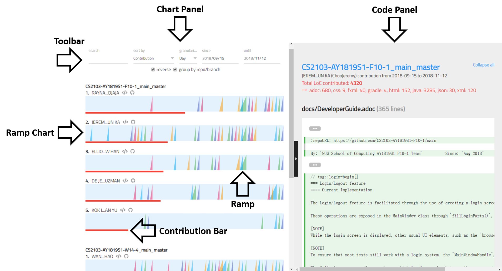

# RepoSense - User Guide

* [Prerequisites](#prerequisites)
* [Getting Started](#getting-started)
* [Generating the Report](#generating-the-report)
  * [How to Generate Report](#how-to-generate-report)
    * [Using repo-config.csv file](#using-repo-configcsv-file)
    * [Using repository location(s)](#using-repository-locations)
  * [How to View Report](#how-to-view-report)
    * [With jar](#with-jar)
    * [Manually](#manually)
  * [Other option](#other-option)
* [Configuring Report Options](#configuring-report-options)
  * [Repository configuration file](#repository-configuration-file)
  * [[Optional] Author configuration file](#optional-author-configuration-file)
    * [Git Author Name](#git-author-name)
  * [[Optional] Preparation of Repositories](#optional-preparation-of-repositories)
    * [Contribution Tags](#contribution-tags)
    * [Standalone Configuration](#standalone-configuration)
* [Interpreting the Report](#interpreting-the-report)
  * [Tool Bar](#tool-bar)
  * [Chart Panel](#chart-panel)
    * [Ramp Chart](#ramp-chart)
    * [Contribution Bar](#contribution-bar)
  * [Code Panel](#code-panel)

## Prerequisites
1. **JDK `1.8.0_60`** or later.
1. **git `2.14`** or later on the command line.
> Type `git --version` on your OS terminal and ensure that you have the correct version of **git**.

## Getting Started
1. Ensure that you have the necessary [prerequisites](#prerequisites).
1. Download the latest executable Jar from our [release](https://github.com/reposense/RepoSense/releases/latest).
   * Alternatively, you can compile the executable Jar yourself by following our [build from source guide](Build.md).
1. Generate the report by executing the jar with the terminal using your repository url as input. <br/>
   For example:
   ```
   java -jar RepoSense.jar -repos https://github.com/reposense/RepoSense.git
   ```

For more information or to customize your own report, do read up on the following:
1. The full guide on [Generating the Report](#generating-the-report).
1. [Configuring Report Options](#configuring-report-options) using CSV file(s).
1. [Interpreting the Report](#interpreting-the-report).

## Generating the Report
1. Download the latest executable Jar from our [release](https://github.com/reposense/RepoSense/releases/latest).
   * Alternatively, you can compile the executable Jar yourself by following our [build from source guide](Build.md).
1. To generate the report, please refer to [How to Generate Report](#how-to-generate-report).
1. To view the generated report, please refer to [How to View Report](#how-to-view-report).
1. Otherwise, you can also refer to [Other option](#other-option) on how to execute the program using source code.

### How to Generate Report
* [Using repo-config.csv file](#using-repo-configcsv-file).
* [Using repository location(s)](#using-repository-locations).

#### Using repo-config.csv file
Usage: `java -jar RepoSense.jar [-config CONFIG_DIRECTORY] [-output OUTPUT_DIRECTORY] [-since DD/MM/YYYY] [-until DD/MM/YYYY] [-formats FORMAT...]`

Sample usage to generate the report (with -config):
```
java -jar RepoSense.jar -config ./configs/ -output output_path/ -since 01/10/2017 -until 01/11/2017 -formats java adoc js
```

#### Using repository location(s)
Usage: `java -jar RepoSense.jar -repos REPO_PATH... [-output OUTPUT_DIRECTORY] [-since DD/MM/YYYY] [-until DD/MM/YYYY] [-formats FORMAT...]`

Sample usage to generate the report:
```
java -jar RepoSense.jar -repos https://github.com/reposense/RepoSense.git https://github.com/se-edu/collate.git -output output_path/ -since 01/10/2017 -until 01/11/2017 -formats java adoc js
```

> Note: The report will be generated in the designated OUTPUT_DIRECTORY, or current working directory otherwise.

Argument List:
- config<sup>^</sup> : Optional. The path to the directory that contains the configuration file(s). <br/>
  If not provided, it will be obtained from the current directory.
- repo/repos<sup>*^</sup> : Mandatory. The GitHub URL or disk location of the git repositories to clone. <br/>
  For example, `C:\Users\user\Desktop\GitHub\RepoSense`
- output : Optional. The path to the report generated. <br/>
  If not provided, it will be generated in the current directory.
- since : Optional. The start date of analysis. Format: `DD/MM/YYYY`
- until : Optional. The end date of analysis. Format: `DD/MM/YYYY`
- formats<sup>*</sup> : Optional. The file formats to analyze. Formats: `alphanumerical file formats`. <br/>
  If not provided, the following file formats will be used: <br/>
  `adoc cs css fxml gradle html java js json jsp md py tag xml`

<sup>* **Multi-value field**: multiple values can be entered in this field by separating them with a space, ` `.</sup><br/>
<sup>^ **Mutual exclusive**: only one of the arguments, in the mutually exclusive group, can be present at one time.</sup>

### How to View Report
* [With jar](#with-jar).
* [Manually](#manually).

#### With jar
1. Ensure that you have generated the report.
1. Execute it on the OS terminal. <br/>
Usage `java -jar RepoSense.jar -view REPORT_DIRECTORY`

```
java -jar RepoSense.jar -view output_path/reposense-report
```
Argument List:
- view<sup>^</sup> : Mandatory. The server will be started to display the report in the specified directory.

<sup>^ **Mutual exclusive**: only one of the arguments, in the mutually exclusive group, can be present at one time.</sup>

#### Manually
1. Ensure that you have [generated the report](#how-to-generate-report).
1. To visualize the report, open `index.html` (generated in the OUTPUT_DIRECTORY).
1. If the report was not loaded automatically, upload the `archive.zip` (in the same directory) manually to load the data.
```
Note:
The contribution calculation is based on the daily commits made within 00:00 to 23:59 in GMT+8.
Any other arguments entered with -view will be ignored.
```

### Other option:
1. Clone this repository (or [download as zip](https://github.com/reposense/RepoSense/archive/master.zip))
1. Execute the following command on the OS terminal inside the project directory. <br/>
Usage: `gradlew run -Dargs="([-config CONFIG_FOLDER] | -repos REPO_PATH_OR_URL... | -view REPORT_FOLDER) [-output OUTPUT_DIRECTORY] [-since DD/MM/YYYY] [-until DD/MM/YYYY] [-formats FORMAT...]"` <br/>

Sample usage to generate the report with no specify arguments: (find and use config files in current working directory) 
```
gradlew run
```

Sample usage to generate the report with config files:
```
gradlew run -Dargs="-config ./configs/ -output output_path/ -since 01/10/2017 -until 01/11/2017 -formats java adoc js"
```

Sample usage to generate the report with repository locations:
```
gradlew run -Dargs="-repos https://github.com/reposense/RepoSense.git https://github.com/se-edu/collate.git -output output_path/ -since 01/10/2017 -until 01/11/2017 -formats java adoc js"
```

Sample usage to view the report:
```
gradlew run -Dargs="-view output_path/reposense-report"
```
`-Dargs="..."` uses the same argument format as mentioned above.

## Configuring Report Options
There are 2 CSV file(s) that can be used to customize your report:
1. [Repository configuration file](#repository-configuration-file)
1. [[Optional] Author configuration file](#optional-author-configuration-file)

Do also read up on [Preparation of Repositories](#optional-preparation-of-repositories) on how to further enhance the 
accuracy of RepoSense analysis.

### Repository configuration file
to configure the list of repositories to analyze and the respective repository level options. <br/>
[repo-config.csv](repo-config.csv) is an example of a configuration file setup. It should contain the following columns:

Column Name | Explanation
----------- | -----------
Repository's Location | The `GitHub URL` or `Disk Path` to the git repository
Branch | The branch to analyze in the target repository
[Optional] File formats<sup>*</sup> | The file formats to analyze in `alphanumerical`. If not provided, the following file formats will be used. `adoc; cs; css; fxml; gradle; html; java; js; json; jsp; md; py; tag; xml`
[Optional] Ignore Glob List<sup>*</sup> | The list of file path globs to ignore during analysis for each author. More details on the Java glob standard [here](https://javapapers.com/java/glob-with-java-nio/)
[Optional] Ignore standalone config | Ignore the presence of standalone config in target repository. To do so, enter **`yes`** in this column. Otherwise, the configuration in the target repository will be used by default.
[Optional] Ignore Commit List<sup>*</sup> | The list of commits to ignore during analysis. For accurate results, the commits should be provided with their full hash.

<sup>* **Multi-value column**: multiple values can be entered in this column using a semicolon, `;`, separator.</sup>

### [Optional] Author configuration file
to configure the list of authors to analyze and the options. <br/>
[author-config.csv](author-config.csv) is an example of a configuration file setup. It should contain the following columns:

Column Name | Explanation
----------- | -----------
Repository's Location | The `GitHub URL` or `Disk Path` to the git repository
Branch | The branch to analyze in the target repository
Author's GitHub ID | GitHub ID of the target contributor in the repository
[Optional] Author's Display Name | The value of this field, if not empty, will be displayed in the report instead of author's GitHub ID.
[Optional] Author's Git Author Name<sup>*</sup> | Detailed explanation below
[Optional] Ignore Glob List<sup>*</sup> | The list of file path globs to ignore during analysis for this author on top of what is already specified in `author-config.csv`. More details on the Java glob standard [here](https://javapapers.com/java/glob-with-java-nio/)

<sup>* **Multi-value column**: multiple values can be entered in this column using a semicolon, `;`, separator.</sup>

<h5>
Note:
If author-config.csv is not used or the repositories being analyzed are not specified by any authors
in author-config.csv, add <a href="#standalone-configuration">Standalone Configuration</a> to those repostories.
Otherwise, all the authors of the repositories will be added into the report by default.
</h5>

#### Git Author Name
`Git Author Name` refers to the customizable author's display name set in the local `.gitconfig` file.
It is displayed as author name as opposed to the `GitHub ID` in the entries.
For example, in the Git Log's display:
```
...
commit cd7f610e0becbdf331d5231887d8010a689f87c7
Author: ConfiguredAuthorName <author@example.com>
Date:   Fri Feb 9 19:14:41 2018 +0800

    Make some changes to show my new author's name

commit e3f699fd4ef128eebce98d5b4e5b3bb06a512f49
Author: ActualGitHubId <author@example.com>
Date:   Fri Feb 9 19:13:13 2018 +0800

    Initial commit
 ...
```
**ActualGitHubId** and **ConfiguredAuthorName** are both `Git Author Name` of the same author.

By default, Git uses the authors' `GitHub ID` as their `Git Author Name`.
However, this is not always the case. Many Git users customize their `Git Author Name`.

To fix this, authors can use the following command to reset their `Git Author Name` to `GitHub ID` before contributing:
```
git config --global user.name “YOUR_GITHUB_ID_HERE”
```
For more information, do visit this [FAQ](https://www.git-tower.com/learn/git/faq/change-author-name-email) on changing Git Author Identity.

If an author's `Git Author Name` is not the same as his `GitHub ID`, the `Git Author Name` needs to be filled into the `author-config.csv` file for accurate consolidation.
In the event that the author has more than one `Git Author Name`, multiple values can be entered in the `Git Author Name` column by using a semicolon `;` separator.
For example,`Alice;Bob`.

### [Optional] Preparation of Repositories
- [Contribution Tags](#contribution-tags)
- [Standalone Configuration](#standalone-configuration)

#### Contribution Tags
Although RepoSense's contribution analysis is quite accurate, authors can use annotations to ensure that RepoSense correctly recognizes their contribution.
Special thanks to [Collate](https://github.com/se-edu/collate) for providing the inspiration for this functionality.

There are 2 types of tags:
- Start Tags (`@@author YOUR_GITHUB_ID`)
- End Tags (`@@author`)

Below are some examples (by the courtesy of Collate's User Guide):


You can use `Start Tags` to mark the start of your contribution. The author specified in the `Start Tags` will be recognized by RepoSense as the author for all lines between a `Start Tag` and the next `End Tag`. If RepoSense cannot find a matching `End Tag` for a `Start Tag` in the same file, it will assume that all lines between the `Start Tag` to the end of the file is authored by the author specified in the `Start Tag`.

#### Standalone Configuration

Instead of self-configuring all the repository details, you can have the repository owners include a *Standalone Configuration* to maintain their own repository configuration. For more information, check out the
[Setup Standalone Configuration](StandaloneConfiguration.md#reposense---guide-to-setup-standalone-configuration).

## Interpreting the Report
The report is written in HTML and Javascript as static pages - readable by majority of web browsers, 
and easily deploy-able in most hosting platforms (such as [GitHub Pages](https://pages.github.com/)).

Below is an example of how the report looks like:



It consists of three main parts: 
* [Tool Bar](#tool-bar)
* [Chart Panel](#chart-panel)
* [Code Panel](#code-panel)

### Tool Bar
The `Tool Bar` at the top provides a set of filters that control the `chart panel`.
- `Search` : filters the author and repository by keywords.
  - Multiple keywords/terms can be used, separated by spaces.
  - Only entries that contain _any_ (not necessarily _all_) of the search terms will be displayed.
- `Sort by` :
  - `Total Contribution` : the amount of lines, written by the author, in the repository.
  - `Variance` : the [variance](https://en.wikipedia.org/wiki/Variance) of the number of lines that the author has contributed to the repository daily, sorted from low to high.
  - `Author Name` : the Author's Display Name configured in the [Author configuration file](#optional-author-configuration-file).
  - `Team Name` : see below<sup>1</sup>. 
- `Granularity` : the period of time each `ramp` represents.
  - You can choose between two time period:
    - `Day`
    - `Week`
- `Since` & `Until` : the date range for the `ramp charts` display.
- `Reverse` (checkbox) : if checked, the sorting will be done in the reverse order of the default sorting order
- `Group` (checkbox) : if checked, authors from the same team<sup>1</sup> will be grouped together.
  - This has precedence over the `sort by` filter; the `sort by` filter will only change display order of the authors under the same team<sup>1</sup>.
- Bookmark :
  - The URL changes according to the toolbar configuration.
  - You can restore your settings by bookmarking the url (using browser functionality) for revisiting later.

<sup>1 Team: authors in the same organization, repository and branch. The team name will correspondingly be in the format: *ORGANIZATION_REPOSITORY_BRANCH*</sup>


### Chart Panel
The `Chart Panel` contains two type of indicators:
- [Ramp Chart](#ramp-chart)
- [Contribution Bar](#contribution-bar)

#### Ramp Chart
To illustrate frequency and amount of contribution in the same graph, and to allow easy comparison between each entry, we implemented a new type of visualization.
This is referred as the `Ramp Charts`.

Below are a few examples:


Each light blue bar represents the contribution timeline of an individual author for a specific repository. Each row, there are several **ramps**.
- The area of the ramp is proportional to the amount of contribution the author did at that time period.
- The position of the right edge of the ramp (perpendicular to the blue bar) is dependent on the time period that ramp represents.
- To make comparison between two authors easier, the color of the ramps that represent different authors' contributions at the same time period are the same.
- The timelines (blue bar) of the charts should be aligned, so that the comparison of contribution between two authors are easier.
- There is no limit to the area of the ramp. If the contribution for a time period is too large compared to the rest of the time period, it is going to overlap with the neighbor ramps. Thus, the ramps are transparent, so they will not cover their neighbors.
- When user hovers the pointer over a ramp, as shown in the above Figure, total amount of contribution over the time period will be shown.
- Clicking on the ramp will redirect user to the GitHub page, which contains all the commits within the fixed time period.

#### Contribution Bar
The total amount of code contributed is represented by the **red bars**, and the length of these red bars is proportional to the total contribution of the corresponding author.
Hovering over the bar shows the exact amount of contribution.
If the author contributes **too much** compared to other authors, there will be multiple red bars in his `Chart Panel`.


### Code Panel
The `Code Panel` allows users to review contributers' code, showing all the lines written by the selected author.
Clicking on the name of the author, in the `Chart Panel`, will display the `Code Panel` on the right.

Below is the list of features in this panel:
- Files that contain author's contribution will be shown in this panel, sorted by the number of lines written.
- Clicking the file title will show/hide the file content.
- Huge changes that are **NOT** written by the selected author are hidden in collapsable boxes.
  - User can click on the boxes to display the hidden lines for context.
- Code written by the author will be highlighted in green.

