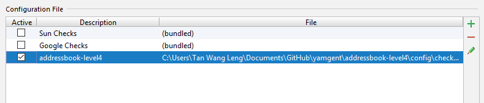

<frontmatter>
  title: "Using Checkstyle-IDEA"
  header: header.md
  footer: footer.md
  siteNav: mainNav.md
  pageNav: 2
</frontmatter>

# Using Checkstyle-IDEA

## Configuring Checkstyle-IDEA

1. Install the Checkstyle-IDEA plugin by going to `File` > `Settings` (Windows/Linux), or `IntelliJ IDEA` > `Preferences...` (macOS).  
Select `Plugins`, press `Browse Repository`, and find the plugin.  
Restart the IDE to complete the installation.
2. Click `File` > `Settings...` > `Other Settings` > `Checkstyle`
3. Set `Scan Scope`  to `Only Java sources (including tests)`, so that the plugin will run checkstyle for our test source codes as well.
4. Ensure that the `Checkstyle version` is set to `8.1`. This is the same version that we are using inside Gradle, so that you won't get any errors due to version incompatibility.  
   * If `Checkstyle version` is not set to `8.1`, set it to version `8.1` and click `Apply`.  
    
5. Click the plus sign under `Configuration File`.
6. Enter an arbitrary description e.g. `reposense`.
7. Select `Use a local Checkstyle file`.
8. Use the checkstyle configuration file found at `config/checkstyle/checkstyle.xml`.
9. Click `Next` > `Finish`.
10. Mark `Active` for the newly imported check configuration.  
    
11. Click `OK`.

## Troubleshooting Checkstyle-IDEA

**Problem: When importing `checkstyle.xml`, Checkstyle-IDEA plugin complains that `The Checkstyle rules file could not be parsed. ... The file has been blacklisted for 60s.`**

* Reason: `checkstyle.xml` is written for a particular version, but the plugin was not configured to the correct version.
* Solution: Ensure that you have selected the correct `Checkstyle version` that matches the version in `build.gradle` and have clicked `Apply`, as `checkstyle.xml` is written for Gradle's checkstyle.

**Problem: After setting up `checkstyle.xml`, Checkstyle-IDEA plugin does not seem to highlight the errors / real-time scanning seems broken.**

* Reason: The plugin may not immediately run after setting it up.
* Solution: Restart the IDE.
