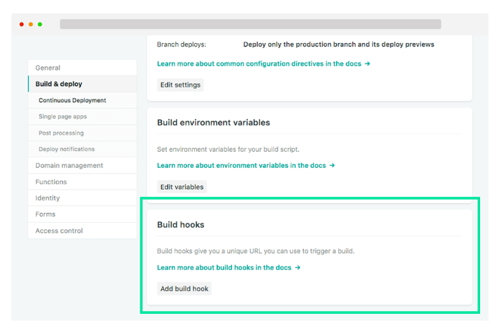
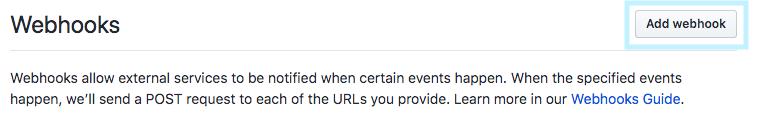
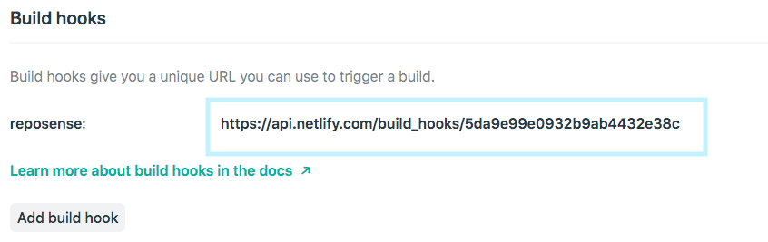

## Using RepoSense with Netlify

[Netlify](https://www.netlify.com) enables you to run RepoSense directly on your target repository. You can do everything on the browser itself and Netlify will handle running RepoSense for you. Therefore, as a user you don't need to download the latest jar file every time when wanting to run RepoSense.

1. Fork the RepoSense repository using this [link](https://github.com/repoSense/RepoSense/fork).
1. Set up Netlify in your forked repository. We recommend this [site](https://www.netlify.com/blog/2016/09/29/a-step-by-step-guide-deploying-on-netlify/) for ease of setup. Please refer to the fields below for **Step 5**.
   
   **Build command**:
   ```
   ./gradlew run -Dargs="--repos YOUR_TARGET_REPO --output output_path/ --formats java adoc js"
   ```
   **Publish directory**:
   ```
   /output_path/reposense-report
   ```
1. Click on **Settings** in the top, choose **Build & deploy** from the left panel and scroll to **Build hooks**.
   
1. Click **Add build hook**, give your webhook a name, and choose the `master` branch to build. A Netlify URL will be generated.
1. Go to your target repository (the repository you want to analyze) and click on **Settings**.
1. Select **Webhooks** on left panel and click on **Add webhook**.
   
1. Copy the Netlify URL and paste it in the URL form field.
   
   > Note: Although the build url is not that secretive, it should be kept safe to prevent any misuse.
1. Select **application.json** as content type.
1. Select **Let me select individual events** and based on your requirements check the checkboxes.
1. Leave the **Active** checkbox checked.
1. Click on **Add webhook** to save the webhook and add it.

> This should cause Netlify to deploy your site each and every time based on your checked checkboxes. Please make sure your forked repository is **up-to-date** with upstream to enjoy the latest features.

### If you wish to customize using `config files`

Using `config files` lets you generate a more customised report. Please refer to [how to customize using csv config files](UserGuide.md#customize-using-csv-config-files) for a more detailed explanation.

In **Step 5** for **Build Command** use:

```
./gradlew run -Dargs="--config ./configs/ --output output_path/  --formats java adoc js"
```

Alternatively, if you want to customise the location of the config files, use:
```
./gradlew run -Dargs="--config YOUR_CONFIG_FILE_LOCATION --output output_path/  --formats java adoc js"
```
