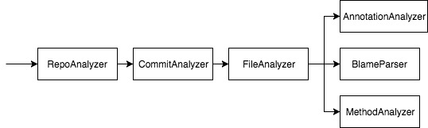
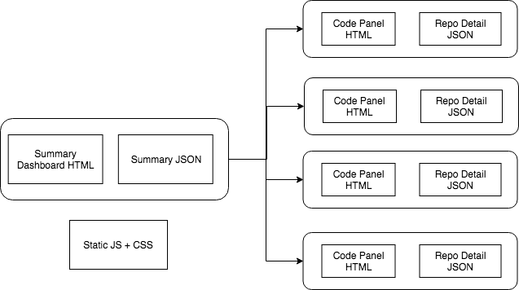

# Developer Guide
Thank you for contributing to RepoSense!
- [Setting Up](#setting-up)
- [Architecture](#architecture)
- [Notable POJOs](#notable-pojos)
- [Frontend Components](#frontend-components)
- [Dashboard Generator Components](#dashboard-generator-components)
- [Git Utilities](#git-utilities)
- [Analyzer Components](#analyzer-components)
- [HTML Dashboard](#html-dashboard)

## Setting up

### Prerequisites

1. **JDK `1.8.0_60`**  or later
2. **Git** on the command line  
> Ensure that you're able to use it on the OS terminal.  
3. **IntelliJ** IDE [Optional]

### Setting up the project in your computer using IntelliJ
1. Fork this repo, and clone the fork to your computer.
2. Open IntelliJ (if you are not in the welcome screen, click `File` > `Close Project` to close the existing project dialog first).
3. Set up the correct JDK version for Gradle.
4. Click `Configure` > `Project Defaults` > `Project Structure`.
5. Click `New…​` and find the directory of the JDK.
6. Click `Import Project`.
7. Locate the build.gradle file and select it. Click OK.
8. Ensure that the selected version of `Gradle JVM` matches our prerequisite.
9. Click `OK` to accept the all the other default settings.

#### Verifying the setup
1. Ensure that Gradle build without error.
2. Run the tests to ensure they all pass.
   1. Go to `src` -> `main` -> `test`. Right click -> Run Tests.

#### Configuring the coding style
This project follows [oss-generic coding standards](https://oss-generic.github.io/process/docs/CodingStandards.html). IntelliJ’s default style is mostly compliant with our Java coding convention but it uses a different import order from ours. To rectify,

1. Go to `File` > `Settings…`​ (Windows/Linux), or `IntelliJ IDEA` > `Preferences…`​ (macOS)
2. Select `Editor` > `Code Style` > `Java`
3. Click on the `Imports` tab to set the order
   * For `Class count to use import with '*'` and `Names count to use static import with '*'`: Set to `999` to prevent IntelliJ from contracting the import statements
   * For `Import Layout`: The order is `import static all other imports`, `import java.*`, `import javax.*`, `import org.*`, `import com.*`, `import all other imports`. Add a ``<blank line>`` between each `import`

Optionally, you can follow the [Using Checkstyle](UsingCheckstyle.md) document to configure Intellij to check style-compliance as you write code.

### Before writing code
1. Do check out our [process guide](../docs/Process.md) before start making changes.

## Architecture

 

 Above is the overall architecture of RepoSense. User imports a CSV configuration file into the Frontend.
 After that, the CSV file will be parsed in Backend, and Git Component will clone and analyze the projects listed in CSV. The result from Git will be parsed and aggregated with syntax information from javaparser, will be output into a JSON file.
 Finally, Report Generator will copy the report template into the designated location, and put in the JSON file, and user can browse the report in any browser, or deploy it onto his server.

## Notable POJOs
### RepoConfiguration
RepoConfiguration stores the configuration information for one single repository, including repository orgarization, name, branch, author whitelist etc.

It should be read-only. It can be constructed using **ConfigurationBuilder**.

### `FileInfo`
FileInfo contains the result of one single file. It has two main parts:
1. an ArrayList of `LineInfo`
2. a Map of Author to the number of lines he contributed
### `LineInfo`
LineInfo contains:
1. line number
2. content of the line
3. the author of the line
### `CommitInfo`
CommitInfo contains the information of a commit, including hash, committer, number of insertions and deletions.

## Frontend Components
Frontend parses the CSV file and the CLI arguments, and build a list of RepoConfigurations, one for each repository.

The list of RepoConfigurations will be passed to RepoInfoFileGenerator.

## Dashboard Generator Components
### `ContributionSummaryGenerator`
`RepoInfoFileGenerator` utilizes `RepoAnalyzer` to generate the contribution summary of each repository and output them as json files.
These json files are import by **summary.js** to generate the dashboard displayed in the **index.html**.

## Git Utilities
Calling Git Commands and parsing the output is essential in RepoSense. Thus, wrapper for each Git command is written.

### CommandRunner
Command Runner creates processes which runs System Commands. It is mainly used to run Git commands in RepoSense.

If command failed to execute, (for example, Git Clone failed to download the repo, or Git Blame on a non-existent file), a RuntimeException will be thrown.

### GitCloner
Wrapper for `git clone`

API:

Return type | Method and Description
----------- | ----------------------
void | `downloadRepo(String organization, String repoName, String branchName) throws GitClonerException`

### GitChecker
Wrapper for `git checkout`

Return type | Method and Description
----------- | ----------------------
void | `checkOutToRecentBranch(String root)`:root is the root location of the Git Repo
void | `checkoutBranch(String root, String branch)`:root is the root location of the Git Repo
void | `checkOutToCommit(String root, CommitInfo commit)`:root is the root location of the Git Repo
void | `checkout(String root, String commitHash)`:root is the root location of the Git Repo

### GitBlamer
Wrapper for `git blame`

Return type | Method and Description
----------- | ----------------------
void | `aggregateBlameInfo(FileInfo fileInfo, RepoConfiguration config)`:put author information into each line of the file.

### GitLogger
Wrapper for `git log`

API:

Return type | Method and Description
----------- | ----------------------
List<CommitInfo> | `getCommits(RepoConfiguration config)`

## Analyzer Components
 
Above is the overall structure of the analyzer. There are several notable classes:

### RepoAnalyzer
RepoAnalyzer does the following things in order:
1. Use `GitChecker` to checkout to the target branch
2. Use `GitLogger` to extract relevant Commit information
3. Use `ContentAnalyzer` to identify the author of each line of code

### ContentAnalyzer
ContentAnalyzer does the following things in order:
1. Use `FileAnalyzer` to analyze contribution in releavant files
2. Generate HashMap of author to number of lines each he contributed

### FileAnalyzer
File Analyzer does  the following things in order:
1. Recursively go through the whole repository to find all relavant files(files with relevant file type)
2. Create a threadpool to analyze individual files, the analysis process includes:
    1. generate LineInfo for each line of code
    2. Use `GitBlamer` to identify the author of each line
    3. **currently disabled**.Use CheckStyleParser to identify possible issues with the code
    4. Use AnnotatorAnalyzer to override GitBlamer's result

## HTML Dashboard

 

The dashboard is consisted of two main parts: data JSONs (generated by analyzer), and static Dashboard template.

The dashboard template is a set of HTML + CSS + Javascript. It is located in `template/`
When you build RepoSense using Gradle, a script will zip the content in `template/` and put it under `src/main/resources/`, which will then be copied into the Jar.
When RepoSense generates a new report, the template will be unzipped to the target location, and data JSONs will be put in.

As shown in the graph above, there will be only one summary JSON(containing information on contribution progress on all repositories), and one repo detail JSON for each repository(containing information on every line of code in the repository).
