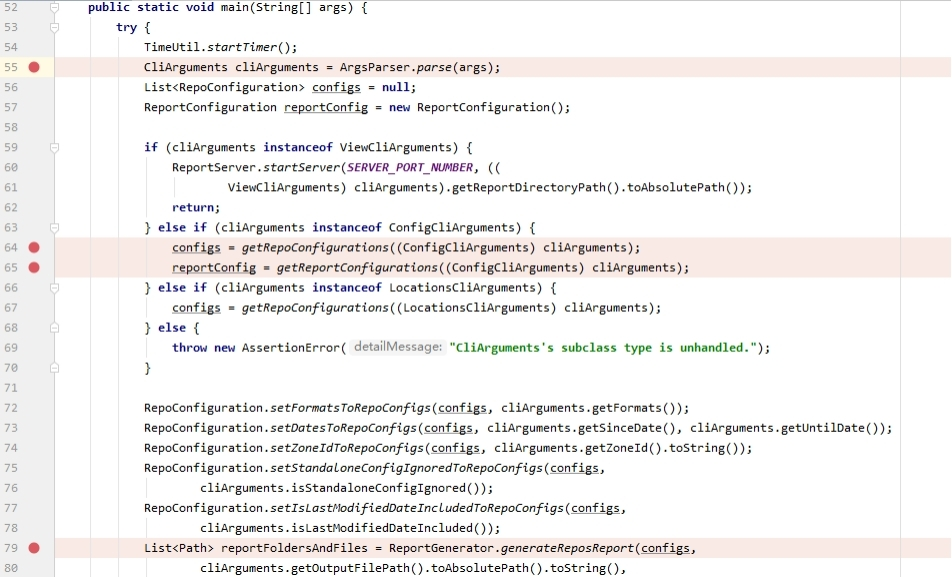

<variable name="title">Learning the Basics</variable>
<frontmatter>
  title: "{{ title | safe }}"
  pageNav: 3
</frontmatter>



<h1 class="display-4"><md>{{ title }}</md></h1>

<div class="lead">

This is a learning guide for developers who are new to RepoSense.
</div>

<box type="warning" seamless>

Depending on what you have already known and what you would like to work on (back-end or frond-end), you may find certain sections irrelevant to you and you can skip them accordingly.
</box>

## back-end

<box type="info" seamless>

This section is for developers who want to contribute to the back-end of RepoSense. You may skip this section if you want to contribute as a pure front-end developer. Before you get started, you should have set up the project on your computer according to [the _Setting up_ page](settingUp.html).
</box>

The back-end implementation of RepoSense is located in `src/main`.

{{ step(1) }} Meet the language requirement

The RepoSense back-end is mostly written in `Java 8`

1. If you are not familiar with Java, you can refer to the [Java tutorial](https://docs.oracle.com/javase/tutorial/) to learn the basic syntax, standard library, and its object oriented nature. There are also plenty of other resources available from Youtube and other sites, and you should feel free to search for the learning resources that are most suitable to you.
1. You may also find the [Java API](https://docs.oracle.com/javase/8/docs/api/) quite helpful when you are unsure about the usage of a certain class or method in a Java program.

{{ step(2) }} Learn the RepoSense back-end architecture

You may want to refer to the [back-end architecture](architecture.html). This can greatly help you to understand the implementation logic.

To gain a more concrete idea of how the backend works, you can use the IDE Debugger to trace through the steps of how the Json files are generated by taking the following steps.

<box type="warning" seamless>

The steps are for **Intellij**. If you are using a different IDE, you may need to check the documentation of how to use the debugger separately.
</box>

 
*Figure 1. Tracing the execution using the debugger*

1. Check the [debugging guide](https://www.jetbrains.com/help/idea/debugging-your-first-java-application.html) if you are not familiar with debugging in **Intelij**. In particular, learn how to use features such as `step into` and `step over` to trace the program execution.
1. In `RepoSense.java`, set appropriate break points. For example, you can set it according to the diagram above. The first 3 breakpoints are set to inspect how CLI arguments, `csv` files configuration, and `Json` file configuration are retrieved, corresponding to the first step in the architecture diagram. The last break point is set at the `generateReposReport` method, where the bulk of work is conducted, including cloning the repository, analyzing the repository, and generating the `Json` files to be used by the report.
1. In `Edit Confiurations` of **Intellij**, set the current task to be the gradle task `RepoSense [run]`, and click the debugging button on the right to start debugging (Make sure that you import the project as a gradle project according to [the tutorial](https://se-education.org/guides/tutorials/intellijImportGradleProject.html)).
1. Step into each break point when you think it is necessary to know more about the implementation, and step over otherwise to continue the execution.

<box type="info" seamless>

When tracing through the program execution, you can cross reference the architecture diagram and `javadoc` of the class and method to check your understanding of the procedure.
</box>

{{ step(3) }} Get started with contributing

Here is a small [task](https://github.com/reposense/RepoSense/issues/1118) for you to get started on contributing to RepoSense back-end.

* The basic idea is to change or remove the validation for the author name tag located in `AnnotatorAnalyzer.java` by modifying the`REGEX_AUTHOR_NAME_FORMAT` argument.
* You may need to check that the unit and system testing still passes after making the change by running the command `gradlew systemtest` and `gradlew test`.

Here is more explanation about the usage of author tag.

{{ embed("Appendix: **Using `@@author` tags**", "../ug/usingAuthorTags.md") }}

{{ step(4) }} Get familiar with the workflow

1. The next step is to verify that your changes passes the testing and then submit the pull request. You can refer to [the _Workflow_ page](workflow.html).

<!-- ==================================================================================================== -->

## front-end

<box type="info" seamless>

This section is for developers who want to contribute to the back-end of RepoSense. You may skip this section if you want to contribute as a pure front-end developer.
</box>

The front-end implementation of RepoSense is located in `frontend/src`.

{{ step(1) }} Learn the necessary tools

It is necessary for you to learn the basics of `Vue.js`, `pug`, and `scss` before working on the project. 

  {{ embed('Appendix: tools to learn for front-end development', 'tools.md', level=2) }}

{{ step(3) }} Learn the RepoSense front-end architecture

* You may want to refer to the [front-end architecture](report.html#report-architecture) to understand the relationship
* Another way for you to understand the front is to use **Vue.js devtools** to inspect the how the various Vue Components interact with each other. You can refer to the [front-end debugging guide](workflow.html#debugging-front-end) for more information.

{{ step(4) }} Get started with contributing

Here is a small [task](https://github.com/reposense/RepoSense/issues/1268) for you to get started on contributing to RepoSense front-end.

* The general goal is to eliminate the passing of variables that can be shared across different components, and move these variables to the **Vuex store**.
* You can try to move `minDate`, `maxDate`, and `filterSearch` to **Vuex store**. 
* When in doubt, you can refer to the pull request [#1319](https://github.com/reposense/RepoSense/pull/1319) and [#1320](https://github.com/reposense/RepoSense/pull/1320) to view the implementation detail.

{{ step(4) }} Familiarize yourself with the workflow

1. The next step is to verify that your changes passes the testing and then submit the pull request. You can refer to [the _Workflow_ page](workflow.html).

<!-- ==================================================================================================== -->

## Writing documentation

If you want to make contribution to the RepoSense documentation, you can refer to the guide below.

**This project uses [MarkBind](https://markbind.org/)** for documentation. Follow [this tutorial](https://se-education.org/guides/tutorials/markbind.html) to learn how to use MarkBind for updating project documentation.

**To show some content only in the <tooltip content="i.e., https://reposense.org">production website</tooltip>**, add the `tags="production"` attribute to the HTML element enclosing the content. Similarly, `tags="dev"` will make the content appear only in the <tooltip content="i.e., https://reposense.org/RepoSense">dev website</tooltip>.

```html
<span tags="production">This will appear in the production website only.</span>
<span tags="dev">This will appear in the dev website only.</span>
This will appear in both sites.
```

<!-- ==================================================================================================== -->

## Coding standard

* Make sure you know our coding standards.
  {{ embed('Appendix: Coding Standards', 'styleGuides.md', level=2) }}
* **Follow [this](https://se-education.org/guides/tutorials/intellijCodeStyle.html) to configure Intellij to follow our coding style**.
* **This project uses Checkstyle** to check the compliance of Java code. You can use [this document](https://se-education.org/guides/tutorials/checkstyle.html) to find how to use it. In particular, run `gradlew checkstyleMain checkstyleTest checkstyleSystemtest` to check the style of all the relevant Java code.
* **To check Pug files for style errors**, run `npm run lint` from the project root directory. You can use the `npm run lintfix` to automatically fix some of the javascript and css lint errors.

<!-- ==================================================================================================== -->

## DevOps

If you want to work on the Continuous integration of RepoSense, you can refer to the [DevOps guide](https://github.com/reposense/RepoSense/wiki/DevOps-guide) for more information.
