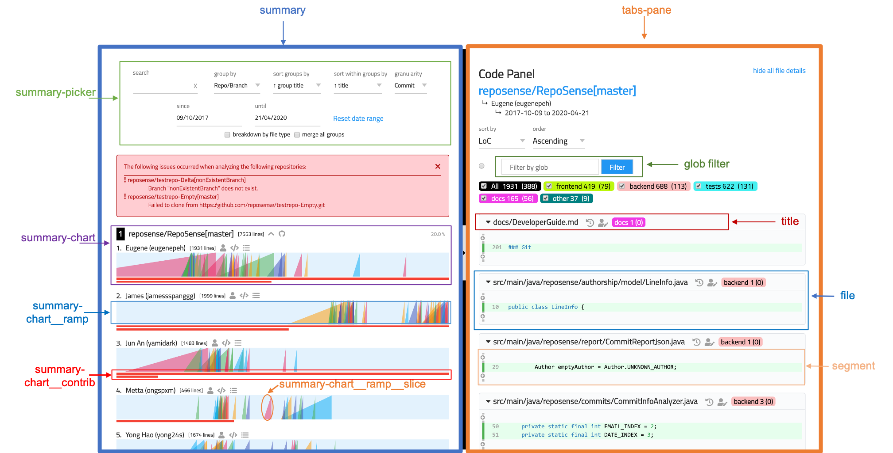


<frontmatter>
  title: "{{ title | safe }}"
  pageNav: 3
</frontmatter>

<h1 class="display-4"><md>{{ title }}</md></h1>

The report's source files are located in [`frontend/src`](https://github.com/reposense/RepoSense/blob/master/frontend/src) and are built by [vue-cli](https://github.com/vuejs/vue-cli) before being packaged into the JAR file to be extracted as part of the report.

[Vue](https://vuejs.org/api/) (pronounced /vjuː/, like view) is a progressive framework for building user interfaces. It is heavily utilized in the report to update the information in the various views dynamically. (Style guide available [here](https://vuejs.org/style-guide/), Developer tool available [here](https://chrome.google.com/webstore/detail/vuejs-devtools/nhdogjmejiglipccpnnnanhbledajbpd)). Vue lifecycle hooks are the defined methods that get executed in a particular stage of the Vue object lifespan. The following is the Vue lifecycle diagram taken from [here](https://vuejs.org/guide/essentials/lifecycle.html#lifecycle-diagram) indicating the hook sequence:

The following is a snapshot of the report:

<!-- ==================================================================================================== -->

## Report architecture

<puml src="../diagrams/ReportArchitecture.puml"/>

The main Vue object (`app.vue`) is responsible for loading the report via an async call to `api.ts`, which parses `summary.json`. Its `repos` attribute is tied to the global `window.REPOS`, and is passed into the various other modules when the information is needed.

The report interface is broken down into two main parts
- the summary view
- and the tabbed interface

The summary view acts as the main report, which shows the various calculations.  
The tabbed interface is responsible for loading various modules such as authorship and zoom to display additional information.

<!-- ==================================================================================================== -->

## Javascript and Vue files

- **main.ts** - sets up plugins and 3rd party components used in the report
- [**app.vue**](#app-app-vue) - module that renders the `router-view`
- [**api.ts**](#data-loader-api-ts) - loading and parsing of the report content
- [**c-home.vue**](#home-view-c-home-vue) - module that supports the report interface
- [**c-widget.vue**](#widget-view-c-widget-vue) - module that supports the widget interface
- [**c-summary.vue**](#summary-view-c-summary-vue) - module that supports the summary view
- [**c-authorship.vue**](#authorship-view-c-authorship-vue) - module that supports the authorship tab view
- [**c-zoom.vue**](#zoom-view-c-zoom-vue) - module that supports the zoom tab view
- [**c-ramp.vue**](#ramp-view-c-ramp-vue) - module that supports the ramp chart view
- [**c-segment.vue**](#segment-view-c-segment-vue) - module that supports the code segment view

<!-- ==================================================================================================== -->

## JSON report files

- **summary.json** - a list of all the repositories and their respective details
- **projName/commits.json** - contains information of the users' commits information (e.g., line deletion, insertion, etc.), grouped by date
- **projName/authorship.json** - contains information from git blame, detailing the author of each line for all the processed files

<!-- ==================================================================================================== -->

## App ([app.vue](https://github.com/reposense/RepoSense/blob/master/frontend/src/app.vue))

This contains the logic for the main VueJS object, `app.vue`, which is the entry point for the web application.

Vuex in `store.ts` is used to pass the necessary data into the relevant modules.

`c-home`, `c-widget`, `c-summary`, `c-authorship`, `c-zoom`, `c-segment`, and `c-ramp` are components embedded into the report and will render the corresponding content based on the data passed into it from Vuex.

### Loading of report information
The main Vue object depends on the `summary.json` data to determine the right `commits.json` files to load into memory. This is handled by `api.ts`, which loads the relevant file information from the network files if available; otherwise, a report archive, `archive.zip`, has to be used.

Once the relevant `commit.json` files are loaded, all the repo information will be passed into `c-summary` to be loaded in the summary view as the relevant ramp charts.

### Activating additional view modules
Most activity or actions should happen within the module itself, but in the case where there is a need to spawn or alter the view of another module, an event is emitted from the first module to the Vuex store, which then handles the data received and passes it along to the relevant modules.

### Hash link
Other than the global main Vue object, another global variable we have is the `window.hashParams`. This object is responsible for generating the relevant permalink for a specific view of the report's summary module.

## Data loader ([api.ts](https://github.com/reposense/RepoSense/blob/master/frontend/src/utils/api.ts))
This is the module that is in charge of loading and parsing the data files generated as part of the report.

### Loading from ZIP file
Due to security design, most modern browsers (e.g., Chrome) do not allow web pages to obtain local files using the directory alone. As such, a ZIP archive of the report information will be produced alongside the report generation.

This archive will be used in place of the network files to load information into the report when the network files are unavailable.

The API module will be handling all requests for all the JSON data files. If the network file is not available, the files will be obtained from the zip archive provided.

### Retrieving and parsing information
After the JSON files are loaded from their respective sources, the data will be parsed as objects and included inside the global storage object, `window.REPOS`,  in the right format.

For the basic skeleton of `window.REPOS`, refer to the generated `summary.json` file in the report for more details.

<!-- ==================================================================================================== -->

## Home view ([c-home.vue](https://github.com/reposense/RepoSense/blob/master/frontend/src/views/c-home.vue))

The `c-home` module is in charge of rendering the main report, and renders `c-resizer`, `c-summary`, `c-authorship` and `c-zoom`.

<!-- ==================================================================================================== -->

## Widget view ([c-widget.vue](https://github.com/reposense/RepoSense/blob/master/frontend/src/views/c-widget.vue))

The `c-widget` module is in charge of rendering the widget from the `iframe` and only renders `c-summary`. An additional prop, `isWidgetMode`, is passed to `c-summary` so it knows to render as a widget and omit unnecessary elements.

<!-- ==================================================================================================== -->

## Summary view ([c-summary.vue](https://github.com/reposense/RepoSense/blob/master/frontend/src/views/c-summary.vue))

The `c-summary` module is in charge of loading the ramp charts from the corresponding `commits.json`.

<puml src="../diagrams/ReportArchitectureSummary.puml"/>

### Initializing the data for the ramp charts
The summary module is activated after the information is loaded from the main Vue.JS object. At creation, the `repo` attribute is populated with the `window.REPOS` object, which contains information loaded from `summary.json`.

### Filtering users and repositories
The commits information is retrieved from the corresponding project folders for each repository. This information will be filtered and sorted before being passed into the template to be displayed as ramp charts.

<!-- ==================================================================================================== -->

## Authorship view ([c-authorship.vue](https://github.com/reposense/RepoSense/blob/master/frontend/src/views/c-authorship.vue))

The authorship module retrieves the relevant information from the corresponding `authorship.json` file if it is not yet loaded. If it has been loaded, the data will be written into `window.REPOS` and be read from there instead.

<puml src="../diagrams/ReportArchitectureAuthorship.puml"/>

### Showing relevant information by authors
The files will be filtered, picking only files the selected author has written in. The lines are then split into chunks of "touched" and "untouched" code segments displayed in the tab view which will be popped up on the right side of the screen.

<!-- ==================================================================================================== -->

## Zoom view ([c-zoom.vue](https://github.com/reposense/RepoSense/blob/master/frontend/src/views/c-zoom.vue))

The `c-zoom` module is in charge of filtering and displaying the commits from the ramp chart's selected sub-range.

<!-- ==================================================================================================== -->

## Ramp view ([c-ramp.vue](https://github.com/reposense/RepoSense/blob/master/frontend/src/components/c-ramp.vue))

The `c-ramp` module is responsible for receiving the relevant information from `c-summary` and generating ramp charts that contain ramp slices.

### Padding for dates
For ramps between the date ranges, the slices will be selected and it will be pre and post padded with empty slices to align the ramp slice between the `sinceDate` and `untilDate`. The ramps will then be rendered with the slices in the right position.

<!-- ==================================================================================================== -->

## Segment view ([c-segment.vue](https://github.com/reposense/RepoSense/blob/master/frontend/src/components/c-segment.vue))

The `c-segment` module is used as a component in `c-authorship`. It separates the code in terms of "touched" and "untouched" segments and only loads each "untouched" segment when it is toggled.
