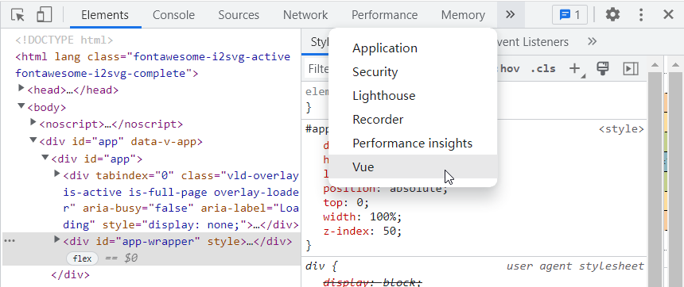
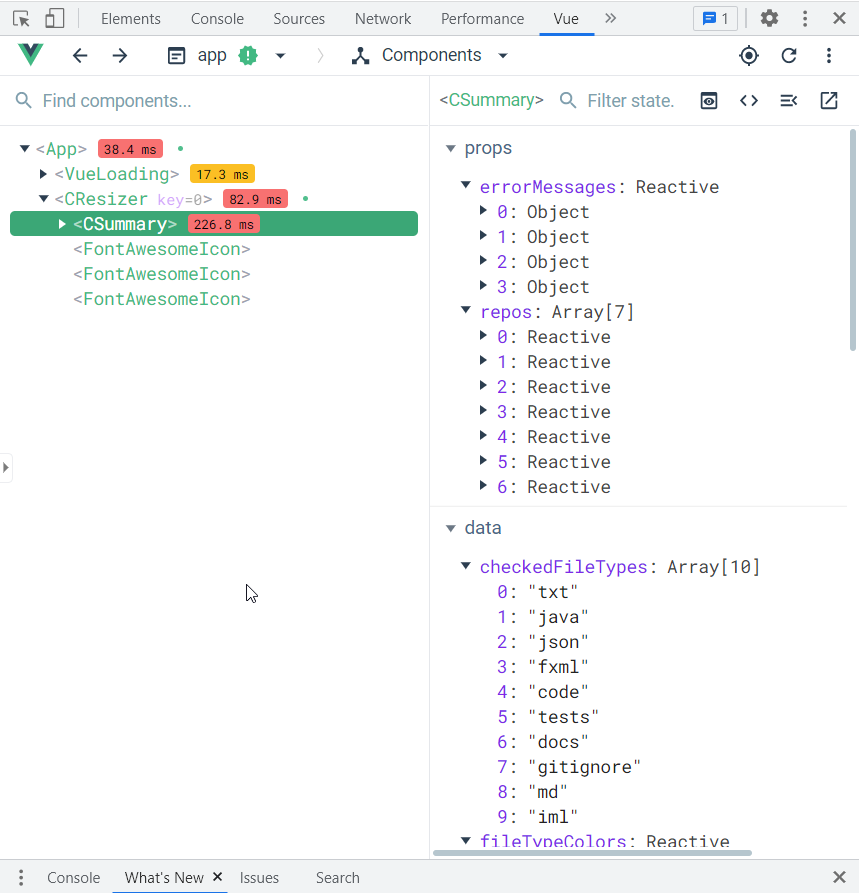

<variable name="title">Workflow</variable>
<frontmatter>
  title: "{{ title | safe }}"
  pageNav: 3
</frontmatter>



<h1 class="display-4"><md>{{ title }}</md></h1>

Our workflow is mostly based on the guidelines given at se-education.org/guides.

**To submit a PR**, follow [this guide](https://se-education.org/guides/guidelines/PRs.html), but note the following:

* As we squash the commits when merging a PR, there is ==no need to follow a strict commit organization or write elaborate commit messages for each commit==. 
  However, when pushing new commits to your PR branch, do clean up _new_ commits (i.e., commits not yet pushed) e.g., delete temporary print statements added for debugging purposes.
* In the PR description, please propose a commit message to be used when the PR is merged eventually. The commit message should follow the guidelines given [here](https://se-education.org/guides/guidelines/PRs.html). You may refer to [this PR](https://github.com/reposense/RepoSense/pull/1057) for an example.
* For simple documentation fixes or tasks with clear instructions, it is unnecessary to create an issue before creating a PR.
* You can refer to the [Architecture](architecture.html) and the [HTML Report](report.html) sections to learn about the design and implementation of RepoSense. 
* The section below has more information about the various stages of submitting a PR.

<!-- ==================================================================================================== -->

## Running the app from code

* To run the app from code, run `gradlew run` from the project root. By default, it will run based on the config files in the `[project root]/config` folder, and generate the report in the `[project root]/reposense-report` folder.
* To supply flags to customize the report, you can use the `-Dargs="[FLAGS]"` format. 
  e.g., `gradlew run -Dargs="--since 31/12/2019 --formats java adoc xml"`
* Run `gradlew run -Dargs="--view"` to generate the report and view it in the default browser.
* You can refer to the panel below for the format of the flags that can be supplied in `-Dargs="[FLAGS]"`.

{{ embed("User guide → Appendix: **CLI syntax reference**", "../ug/cli.md") }}

<!-- ==================================================================================================== -->

## Debugging (front-end)

**You can use Vue.js devtools for frontend debugging on Chrome.** Here are the steps:
1. On your Chrome, visit the website of [Vue.js devtools](https://chrome.google.com/webstore/detail/vuejs-devtools/nhdogjmejiglipccpnnnanhbledajbpd) and add the extension.
1. Go to the detail page of this extension in Chrome's extension management panel and select `Allow access to file URLs`. If you are unable to locate it, copy the link: `chrome://extensions/?id=nhdogjmejiglipccpnnnanhbledajbpd` and visit it on your Chrome.
1. Open any report generated by RepoSense.
1. Press `F12` or right click and choose `inspect` at the report page.
1. Choose `Vue` at the navigation bar. 
   
1. Debug using the tool. 
   

<box type="info" seamless>

See [vue-devtools project home](https://github.com/vuejs/vue-devtools) page for more details.
</box>

<!-- ==================================================================================================== -->

## Testing (front-end)

**We use [Cypress](https://www.cypress.io/) for automated end-to-end front-end testing.**

### Writing tests
1. Create a new test file in `frontend/cypress/tests`.
1. At project root start *Cypress Test Runner* by running `gradlew cypress`.
1. On the top right hand corner, set `Chrome` as the default browser.
1. Under **Integration Tests**, click on the newly created test file to run it.

<box type="info" seamless>

Read [Cypress's Documentation](https://docs.cypress.io/api/commands/document.html#Syntax) to familiarize yourself with its syntax and [Cypress's debugging guide](https://docs.cypress.io/guides/guides/debugging.html#Log-Cypress-events) to tackle problems with your tests.
</box>

<box type="warning" seamless>

Note that it is **compulsory** to add tests for the new front-end changes that you made to prevent regression bugs, except for trivial changes that are unlikely to cause any regression or other situations where testing does not apply to the change.
</box>

<!-- ------------------------------------------------------------------------------------------------------ -->

### Running tests

To run all tests locally, run `gradlew frontendTest`.

<box type="info" seamless>

If you encountered an invalid browser error, ensure that you have `Chrome` installed in the default installation directory. Otherwise, follow the instructions [here](https://docs.cypress.io/guides/guides/debugging.html#Launching-browsers) to create symbolic links so Cypress can locate `Chrome` in your system.
</box>

<!-- ==================================================================================================== -->

## Testing (back-end)

The back-end tests can be found at `[project root]/systemtest` and `[project root]/test`. 

### Running tests

To run all the system tests, run `gradlew systemtest`.

To run all the unit and integration tests, run `gradlew test`.

