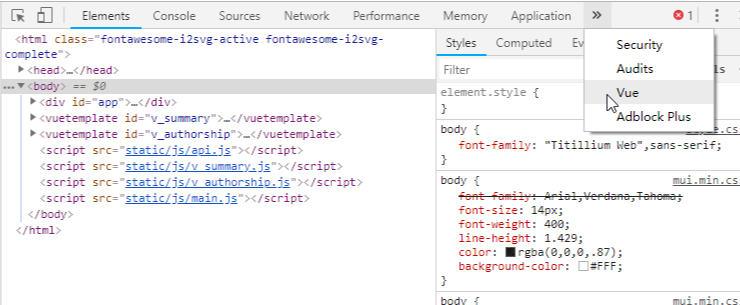
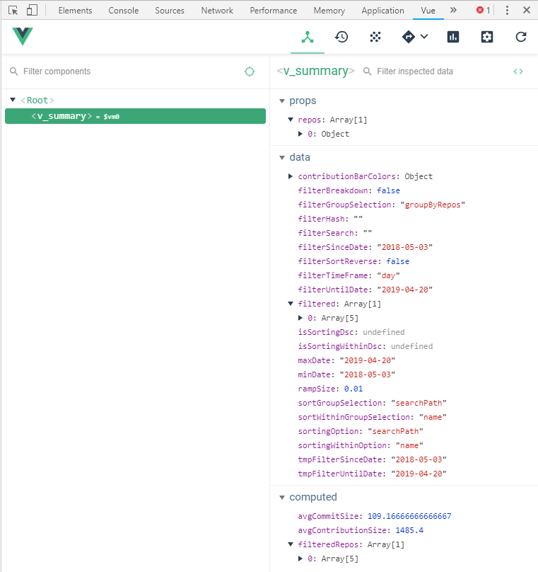

<frontmatter>
  title: "Workflow"
  pageNav: 3
</frontmatter>



<include src="versionWarning.mbdf" />

<h1 class="display-4">Workflow</h1>

Our workflow is mostly based on the guidelines given at se-education.org/guides.

**To submit a PR**, follow [this guide](https://se-education.org/guides/guidelines/PRs.html), but note the following:

* As we squash the commits when merging a PR, there is ==no need to follow a strict commit organization or write elaborate commit messages for each commit==. 
  However, when pushing new commits to your PR branch, do clean up _new_ commits (i.e., commits not yet pushed) e.g., delete temporary print statements added for debugging purposes.
* You can refer to the [Architecture](architecture.html) and the [HTML Report](report.html) to learn about the design and implementation of RepoSense.
* The sections below has more information about various stages of submitting a PR.

<!-- ==================================================================================================== -->

## Following the code style

* Make sure you know our coding standards.
  {{ embed('Appendix: Coding Standards', 'styleGuides.md', level=2) }}
* **Follow [this](https://se-education.org/guides/tutorials/intellijCodeStyle.html) to configure Intellij to follow our coding style**.
* **This project uses Checkstyle** to check the compliance of Java code. You can use [this document](https://se-education.org/guides/tutorials/checkstyleTutorial.html) to find how to use it.
* **To check Pug files for style errors**, run `npm run lint` from the project root directory. You can use the `npm run lintfix` to automatically fix some of the javascript and css lint errors.

<!-- ==================================================================================================== -->

## Running the app from code

* To run the app from code, run `gradlew run` from the project root. By default, it will run based on the config files in the `[project root]/config` folder.
* To supply flags, you can use the `-Dargs="[FLAGS]"` format. 
  e.g., `gradlew run -Dargs="--since 31/12/2019 --formats java adoc xml"`

<!-- ==================================================================================================== -->

## Debugging (front-end)

**You can use Vue.js devtools for frontend debugging on Chrome.** Here are the steps:
1. On your Chrome, visit the website of [Vue.js devtools](https://chrome.google.com/webstore/detail/vuejs-devtools/nhdogjmejiglipccpnnnanhbledajbpd) and add the extension.
1. Go the detail page of this extension in Chrome's extension management panel and select `Allow access to file URLs`. If you are unable to locate it, copy the link: `chrome://extensions/?id=nhdogjmejiglipccpnnnanhbledajbpd` and visit it on your Chrome.
1. Open any report generated by RepoSense.
1. Press `F12` or right click and choose `inspect` at the report page.
1. Choose `Vue` at the navigation bar. 
   
1. Debug using the tool. 
   

<box type="info" seamless>

See [vue-devtools project home](https://github.com/vuejs/vue-devtools) page for more details.
</box>

<!-- ==================================================================================================== -->

## Testing (front-end)

**We use [Cypress](https://www.cypress.io/) for automated end-to-end front-end testing.**

### Writing tests
1. Create a new test file in `frontend/cypress/tests`
1. At project root start *Cypress Test Runner* by running `gradlew cypress`
1. On the top right hand corner, set `Chrome` as the default browser
1. Under **Integration Tests**, click on the newly created test file to run it

<box type="info" seamless>

Read [Cypress's Documentation](https://docs.cypress.io/api/commands/document.html#Syntax) to familiarize yourself with its syntax and [Cypress's debugging guide](https://docs.cypress.io/guides/guides/debugging.html#Log-Cypress-events) to tackle problems with your tests.
</box>

<!-- ------------------------------------------------------------------------------------------------------ -->

### Running tests

To run all tests locally, run `gradlew frontendTest`.

<box type="info" seamless>

If you encountered an invalid browser error, ensure that you have `Chrome` installed in the default installation directory. Otherwise, follow the instructions [here](https://docs.cypress.io/guides/guides/debugging.html#Launching-browsers) to create symbolic links so Cypress can locate `Chrome` in your system.
</box>

<!-- ==================================================================================================== -->

## Writing documentation

This project uses [MarkBind](https://markbind.org/) for documentation. Follow [this tutorial](https://se-education.org/guides/tutorials/markbind.html) to learn how to use MarkBind for updating project documentation.
