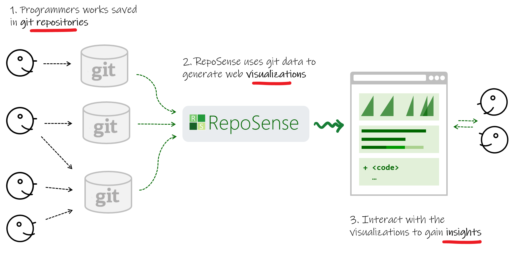

<variable name="title">Home</variable>
<frontmatter>
  title: "{{ title | safe }}"
</frontmatter>



<header>

  

  <h1 class="display-3">RepoSense</h1>
  

Visualize programmer activities across git repositories...
  

  
  

  

</header>

**RepoSense can generate interactive visualizations of programmer activities, even across multiple repositories.** It's ideal for educators and managers to get insights on programming activities of their mentees. The visualizations can be **easily shared** with others (e.g., as an online dashboard) and updating of the visualizations periodically **can be automated**.

<h4>{{ thumbnail(icon) }} {{ text }}</h4>

Some example insights RepoSense can provide:

{{ heading(":fas-code:", "Insights about the code") }}

* Which part of the code was written by Tom? How many lines? How many files?
* Which test cases were written by Kim?
* Which commit messages were written by Serene?

{{ heading(":fas-chart-pie:", "Insights about the type of work") }}

* Which portion of Jacob's code is documentation?
* Who hasn't written any test code yet?
* Which project did Jolene contribute to in the last month?

{{ heading(":fas-business-time:", "Insights about the timing of work") }}

* Who is putting in the consistent effort?
* Who waits till the deadline to do the work?
* Who hasn't started any work yet?

{{ heading(":fas-list-ol:", "Insights based on comparisons") }}

* Which programmers/teams are falling behind?
* How does everyone compare in their front-end coding work over the past two weeks?
* Who are the the top 10 code contributors?

  

  

  

  

[**SHOWCASE** of use cases](showcase.html)

[**ABOUT** us](about.html)

[**CONTACT** us](contact.html)

[**:fab-github: GitHub**](https://github.com/reposense/RepoSense)

----
<small>

This website was built using MarkBind.

Deploy previews are powered by Netlify and Surge.

</small>

  

  

****USER GUIDE****


{{ show_sitenav_items(ug_sitenav_items, is_flat=true) }}

  

  

****DEVELOPER GUIDE****


{{ show_sitenav_items(dg_sitenav_items, is_flat=true) }}

  

  

