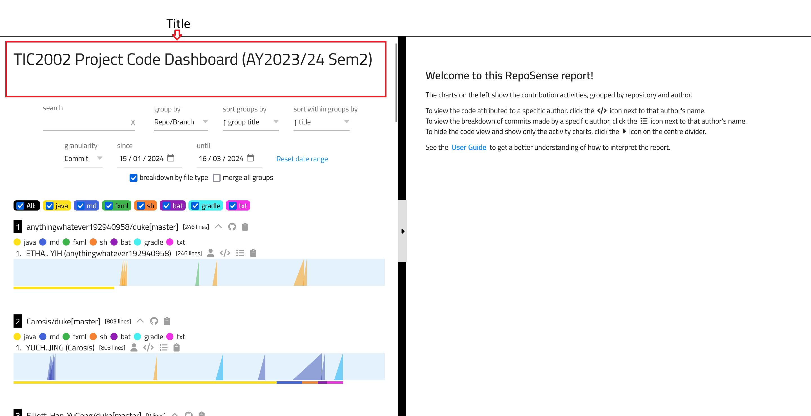


<frontmatter>
title: "{{ title | safe }}"
pageNav: 3
</frontmatter>



<h1 class="display-4"><md>{{ title }}</md></h1>

The report can be customized using several ways, as explained below.

<!-- ------------------------------------------------------------------------------------------------------ -->

### Configuration Options Overview

RepoSense offers multiple ways to customize your reports, with varying levels of complexity and flexibility:

1. **Command-Line (CLI) Flags** - The simplest, most direct approach for quick, one-off customization
2. **RepoSense Configuration Files** - Flexible configuration managed in your config directory:
   - **`report-config.yaml`** - A user-friendly single file for typical use cases
   - **CSV config files** - A more powerful option with granular control for advanced scenarios
   - **Personalization assets** (`favicon.ico`, `title.md`, and blurbs) - Personalize the report with custom icon, title banner, and descriptive blurbs for repos, authors, and charts.
3. **In-Repository Configuration** - Configure individual repositories with their own settings and author annotations

When deciding which configuration method to use:

- **CLI flags** are ideal for quick, one-off reports with minimal customization.
- **RepoSense Configuration Files** provide the best balance of ease-of-use and flexibility for most use cases.
- **In-Repository Configuration** is best for project teams who want to control how their code appears in the report.

<!-- ------------------------------------------------------------------------------------------------------ -->

### Basic Customization using **Command-Line Flags**

**The simplest approach is to provide additional flags when running RepoSense.** The various flags are given in the panel below.

{{ embed("Appendix: **CLI syntax reference**", "cli.md") }}

<!-- ------------------------------------------------------------------------------------------------------ -->

### Advanced Customization using **RepoSense Configuration Files**

This advanced configuration method is more flexible than CLI flags alone, allowing you to define repositories, customize author details, group repositories, and personalize the report — all in dedicated config files.

To use configuration files, specify the config directory when running RepoSense using the `--config` or `-c` flag:

{{ embed("Appendix: **CLI syntax reference → `config` flag**", "cli.md#section-config") }}

#### Using report-config.yaml

**The `report-config.yaml` file provides a more user-friendly way for users to customize their reports in more detail compared to the CLI flags.**

Please refer to this [page](./reportConfig.html) to get started.

<box type="info" seamless>

Note that configurations in `report-config.yaml` takes precedence over the configurations in the CSV config files when both are present.
</box>

#### Using CSV config files

**Another, more powerful, way to customize the report is by using dedicated config files.** You can refer to this [section](./configFiles.html) to find out more about the CSV file formats.

In this case you need to use the `--config` flag instead of the `--repo` flag when running RepoSense, as follows:

{{ embed("Appendix: **CLI syntax reference → `config` flag**", "cli.md#section-config") }}

<box type="tip" seamless>

**Managing config files collaboratively**: If you use RepoSense to monitor a large number of programmers, it may be more practical to get the programmers to submit PRs to update the config files as necessary (<tooltip content="a coder realizes some of her code is missing from the report because she used multiple Git usernames, and wants to add the additional usernames to the config file">example use case</tooltip>).

To ensure that their PRs are correct, you can use [Netlify _deploy previews_](https://www.netlify.com/blog/2016/07/20/introducing-deploy-previews-in-netlify/) to preview how the report would look like after the PR has been merged. More details are in the panels below.

{{ embed("Appendix: **Using RepoSense with Netlify → Setting up**", "withNetlify.md#section-setting-up") }}

{{ embed("Appendix: **Using RepoSense with Netlify → PR previews**", "withNetlify.md#section-pr-previews") }}

</box>

#### Additional Personalization Settings

##### Add favicon.ico

There is a default `favicon.ico` file provided in the template zip folder. If you want to self-configure the `favicon.ico`, please ensure that the file is valid and has the file name of `favicon.ico`. This icon will appear in the browser tab when your report is viewed. Copy or move your `favicon.ico file` into the `assets` folder of the config directory.

##### Add a title

### Personalizing Reports

#### Add favicon.ico
There is a default `favicon.ico` file provided in the template zip folder. If you want to self-configure the `favicon.ico`, please ensure that the file is valid and has the file name of `favicon.ico`. This icon will appear in the browser tab when your report is viewed. Copy or move your `favicon.ico file` into the `assets` folder of the config directory 

Specifying the config directory can be done as follows:
{{ embed("Appendix: **CLI syntax reference → `config` flag**", "cli.md#section-config") }}

#### Add an intro
Add the introductory section of the dashboard by creating an `intro.md` file in the config directory. Existing `title.md` files still work for now, but will be deprecated in favour of `intro.md`.

Specifying the config directory can be done as follows:
{{ embed("Appendix: **CLI syntax reference → `config` flag**", "cli.md#section-config") }}

The intro can render a combination of Markdown/HTML and plaintext ([example](https://github.com/reposense/RepoSense/blob/master/docs/ug/title.md)), and will appear on the top of the left panel as shown below:

Do note that the width of the intro is bound by the width of the left panel.

For more information on how to use Markdown, see the [Markdown Guide](https://www.markdownguide.org/).

##### Add blurbs for branches, authors or charts

A blurb can be added for a repository or author by creating the respective blurb markdown files in the config directory.

- For a repository:
  - Create a file titled `repo-blurbs.md` in the config directory. The format of the file is given below:
    {{ embed("Appendix: **Config files format**", "configFiles.md#section-repo-blurbs") }}
  - The blurbs will be visible when grouping by `Repo/Branch`.
- For an author:
  - Create a file titled `author-blurbs.md` in the config directory. The format of the file is given below:
    {{ embed("Appendix: **Config files format**", "configFiles.md#section-author-blurbs") }}
  - The blurbs will be visible when grouping by `Author`.
- For a chart:
  - Create a file titled `chart-blurbs.md` in the config directory. The format of the file is given below:
    {{ embed("Appendix: **Config files format**", "configFiles.md#section-chart-blurbs") }}

<!-- ------------------------------------------------------------------------------------------------------ -->

### Customize using **In-Repository Configuration**

**If feasible, you can also customize the target repos to play well with RepoSense** in the following ways:

1\. Add a _standalone config file_ to the repo to provide more config details to RepoSense. The format of the file is given below.
{{ embed("Appendix: **Standalone config file format**", "configFiles.md#section-standalone") }}

2\. To have more precise control over which code segment is attributed to which author, authors can annotate their code using `@@author` tags, as explained below.
{{ embed("Appendix: **Using `@@author` tags**", "usingAuthorTags.md") }}

<box type="info" seamless>

In both instances, it is **necessary to commit any changes** for them to be detected by RepoSense.

</box>

3\. Add a Git `.mailmap` file at the top-level of the repository, specifying mapped authors/commiters and/or e-mail addresses as per [gitmailmap documentation](https://git-scm.com/docs/gitmailmap). Any mappings specified here will be applied by Git before all other RepoSense configurations. Configuration via `.mailmap` is particularly useful if you want the mapping to apply for all Git commands as well instead of just for RepoSense.
