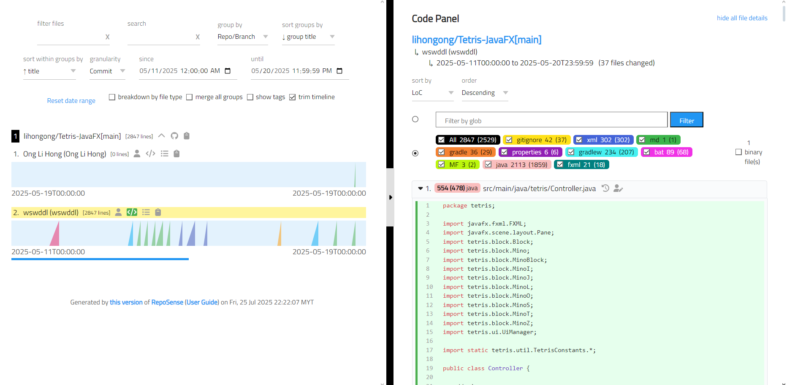
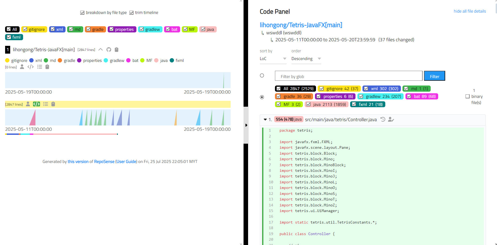
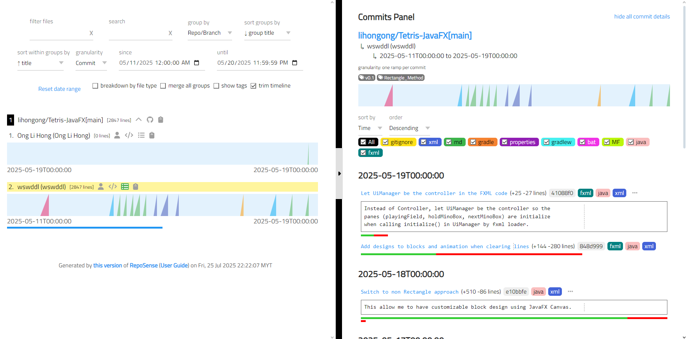
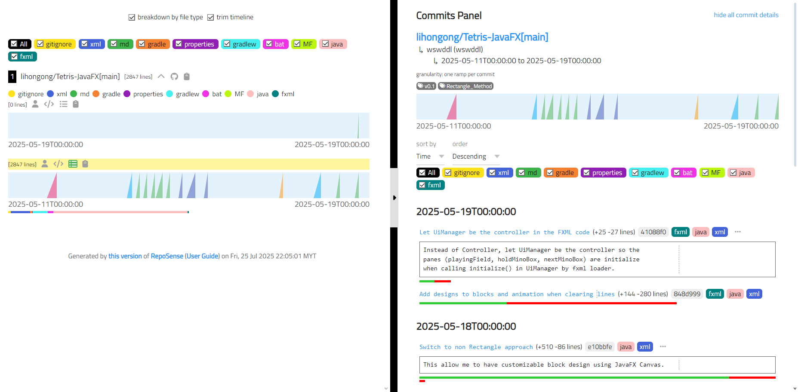

## Portfolio Mode UI

Portfolio Mode is designed to provide a clean and minimalistic overview of a contributor's work. It is intended for showcasing individual contributions in personal portfolios, resumes, or public demos.

### When to use Portfolio Mode?
Use Portfolio Mode when you want to present:
- Your contribution timeline and work summary cleanly.
- A version of the dashboard suited for personal portfolios.

### Key Features:
| Feature                       | Normal Mode                                                 | Portfolio Mode
|-------------------------------|-------------------------------------------------------------|--------------------------------|
| Filters                       | Allow searches, grouping and time period selection          | Simplified filters, non-essential toggles are hidden.             |
| Visual Focus                  | Code review and auditing.                                   | Visual summary of personal contributions (clean & minimal) |
| Intended Use                  | Code analysis and detailed review.                          | Personal portfolio showcase, resume link, project website.   |

### UI Comparison:
| Normal Mode (Default)                             | Portfolio Mode (`--portfolio`)                             |
|---------------------------------------------------|------------------------------------------------------------|
|  |    |
|  |    |

---

### Notes
- You can still use other CLI flags (e.g. `--since`, `--until`) in combination with `--portfolio`.
