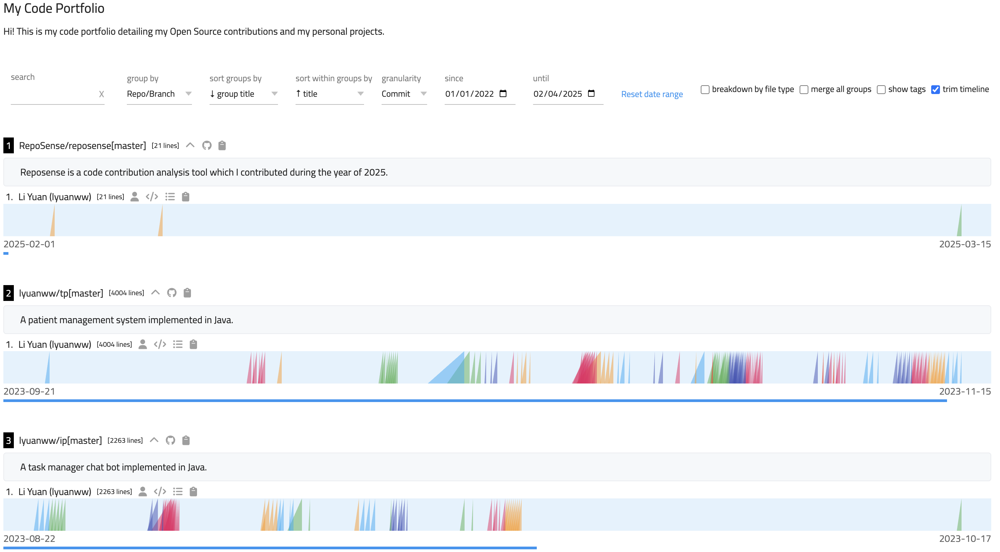


<frontmatter>
title: "{{ title | safe }}"
pageNav: 3
</frontmatter>

<span class="badge bg-danger">mandatory</span>


<h1 class="display-4"><md>{{ title }}</md></h1>

RepoSense allows you to easily showcase your coding portfolio by generating visualization reports of your contributions across different repositories.
This guide will help you set up your first RepoSense report using the `report-config.yaml` file.

## What is `report-config.yaml`?

The `report-config.yaml` file is a simple configuration file that lets you define which repositories you want to include in your RepoSense report in more detail compared to the CLI flags.
It's designed to be user-friendly, especially for beginners who want to quickly set up a code portfolio without dealing with complex configurations.

For more sophisticated use cases that require additional flexibility,
RepoSense's [CSV configuration files](./customizingReports.html#customize-using-csv-config-files) offer an alternative configuration approach with expanded capabilities.

## Quick Start Guide

### Step 1: Create a `report-config.yaml` file

Create a new file named `report-config.yaml` in your project directory with the following basic structure:

```yaml
title: "Your Portfolio Title"
repos:
  - repo: "https://github.com/repo/yourrepo.git"
    branches:
      - branch: main
        blurb: "Short description of this project"
        authors:
          - author-git-host-id: Your username on GitHub, GitLab or Bitbucket
            author-display-name: Your display name
            author-git-author-name: 
              - Author Name Of Your Git Configuration
            author-emails:
              - emails-of-your-commits@email.com
              - emails-of-your-git-configuration@email.com
```

<box type="info" seamless>

The `title` field controls the browser tab text (the HTML `<title>` element). To customize the description that appears at the top of the dashboard itself, provide an `intro.md` file as described [here](./customizingReports.html#add-an-intro).

</box>

<box type="info" seamless>

The `author-display-name`, `author-git-author-name` and `author-emails` fields are optional.

However, users are encouraged to add their Git author name `author-git-author-name` and emails `author-emails` in their Git configuration related to their commits so that
the commits can be successfully captured.
</box>

### Step 2: Add your repositories

You can add multiple repositories to showcase different projects. Here's an example:

```yaml
title: "John Doe's Code Portfolio"
repos:
  - repo: https://github.com/john/ip.git
    branches:
      - branch: master
        blurb: "Individual Project - Task Manager Application"
        authors:
          - author-git-host-id: johnDoe
            author-display-name: John Doe

  - repo: https://github.com/john/tp.git
    branches:
      - branch: master
        blurb: "Team Project - Event Management System"
        authors:
          - author-git-host-id: johnDoe
            author-display-name: John Doe
```

### Step 3: Generate your report

To run RepoSense with `report-config.yaml`:

1. Create a `config` folder in the same directory as the RepoSense.jar file.
2. Add your `report-config.yaml` to the `config` folder.
3. Run the command:`java -jar RepoSense.jar`

<box type="warning" seamless>

Please note that the above command will only analyse your commits one month before the current date. If you would like to
specify the period for report generation, you can use the `--since` and `--until` flags.

`java -jar RepoSense.jar --since START_DATE --until END_DATE`

{{ embed("Appendix: **CLI syntax reference → `since` flag**", "cli.md#section-since-date") }}
{{ embed("Appendix: **CLI syntax reference → `until` flag**", "cli.md#section-until-date") }}

</box>

<box type="info" seamless>

Additionally, you can add a `--portfolio` flag to generate a more optimized view of your report.
</box>

That's it! RepoSense will analyze the repositories you specified and generate a report that visualizes your contributions.

## Example Configuration

Here's a sample `report-config.yaml` file for a student showcasing their work across several projects:

```yaml
title: My Code Portfolio
repos:
  - repo: https://github.com/RepoSense/reposense.git
    groups:
      - group-name: code
        globs:
          - "**.java"
    branches:
      - branch: master
        blurb: "Reposense is a code contribution analysis tool which I contributed."
        authors:
          - author-git-host-id: lyuanww
            author-display-name: Li Yuan
            author-emails:
              - user@gmail.com
              - e0123456@u.nus.edu
  - repo: https://github.com/lyuanww/ip.git
    groups:
      - group-name: code
        globs:
          - "**.java"
    branches:
      - branch: master
        blurb: "A task manager chat bot implemented in Java."
        authors:
          - author-git-host-id: lyuanww
            author-display-name: Li Yuan
            author-emails:
              - user@gmail.com
              - e0123456@u.nus.edu
  - repo: https://github.com/lyuanww/tp.git
    groups:
      - group-name: code
        globs:
          - "**.java"
    branches:
      - branch: master
        blurb: "A patient management system implemented in Java."
        authors:
          - author-git-host-id: lyuanww
            author-display-name: Li Yuan
            author-emails:
              - user@gmail.com
              - e0123456@u.nus.edu
```
### Sample report generated


## Further Customizing Your Report

Optionally, you can provide more detailed descriptions to your report such as an introduction at the top of your dashboard or explanatory blurbs for each repository. Please refer to this [section](./customizingReports.md#personalizing-reports).

## Advanced Report Configuration

For users who need more advanced configuration options, `report-config.yaml` offers many additional features beyond the basic setup. The following section explains the complete syntax and capabilities.

### Complete `report-config.yaml` Example

```yaml
title: RepoSense Report
repos:
  - repo: https://github.com/reposense/publish-RepoSense.git
    groups:
      - group-name: code
        globs:
          - "**.py"
      - group-name: tests
        globs:
          - "src/test**"
      - group-name: docs
        globs:
          - "docs**"
          - "**.adoc"
          - "**.md"
    branches:
      - branch: master
        blurb: "My project"
        authors:
          - author-git-host-id: jedkohjk
            author-display-name: jedkohjk
            author-git-author-name: jedkohjk
            author-emails:
              - email1@example.com
              - email2@example.com
        ignore-authors-list:
          - bot
        ignore-glob-list:
          - "**.in"
        file-size-limit: 2000000
```

### Field Descriptions
Note: All fields are optional unless specified otherwise.

#### Top-Level Fields

* `title`: Sets the title of your generated report, which appears as the title of the deployed dashboard.
    * Default: "RepoSense Report".
* `repos`: A list of repositories to include in your analysis..
    * This field is an array, so you can include multiple repositories.

#### Repository-Level Fields

For each repository in the `repos` list, you can specify:

* `repo` {{ mandatory }} : The URL to the repository you want to analyze.
  * Example: `https://github.com/RepoSense/reposense.git`
* `groups`: Allows you to define custom groupings of files for more organized analysis.
  * This is useful for separating code files, test files, documentation, etc.
  * Each group has:
      * `group-name` {{ mandatory }} : A name for the group (e.g., "code", "tests", "docs").
      * `globs` {{ mandatory }} : File patterns to include in this group using [glob format](https://docs.oracle.com/javase/tutorial/essential/io/fileOps.html#glob).
* `branches` {{ mandatory }} : The branches you want to analyze in the repository.
    * For each branch, you specify:
        * `branch`: The name of the branch (e.g., "master", "main", "develop").
          * Default: The default branch of the repository.
        * `blurb`: A short description of the branch that appears in the report.
            * For more detailed descriptions, you can use a separate `blurbs.md` file.

#### Author Configuration

Within each branch, you can specify:

* `authors`: A list of authors whose contributions you want to track. If none specified, all authors will be shown.
    * For each author:
        * `author-git-host-id` {{ mandatory }} : The GitHub username of the author.
        * `author-display-name`: The name to display in the report (can be different from the GitHub username).
        * `author-git-author-name`: The name used in Git commits.
        * `author-emails`: A list of email addresses associated with the author's commits.

#### Filtering Options

* `ignore-authors-list`: Authors to exclude from the analysis.
    * Specified by their Git Author Name.
    * Useful for excluding bots or automated commit accounts.
* `ignore-glob-list`: Files or directories to exclude from analysis.
    * Uses the [glob format](https://docs.oracle.com/javase/tutorial/essential/io/fileOps.html#glob).
    * Example: `"**.in"` excludes all files with the ".in" extension.
* `file-size-limit`: Maximum file size (in bytes) for analysis.
    * Files larger than this limit will be ignored.
    * Overrides the default file size limit.
