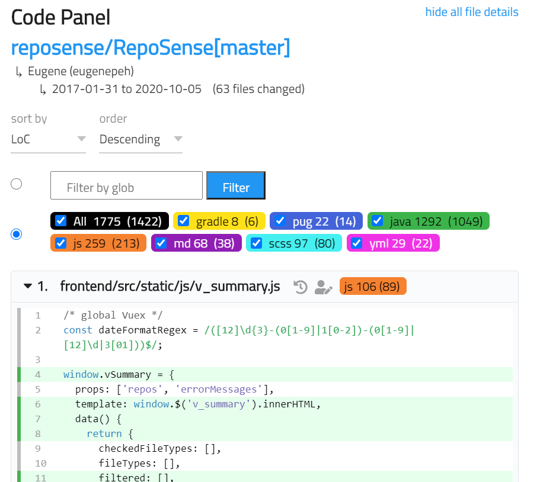
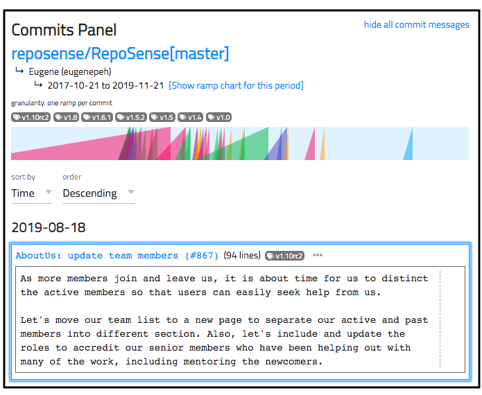


<frontmatter>
  title: "{{ title | safe }}"
  pageNav: 3
</frontmatter>

<h1 class="display-4"><md>{{ title }}</md></h1>

Let's look at how to view, interpret, and interact with a RepoSense report.

<!-- ==================================================================================================== -->

## Viewing the report

As a report consists of web pages, it can be viewed using a Web Browser. Here are the ways to view the report in different situations.

* **Situation 1: The report has been hosted on a website**
  * Simply go to the URL of the report ([example](https://nus-cs2113-ay1920s2.github.io/tp-dashboard)) in your browser.
* **Situation 2: You generated the report in your computer earlier**
  * Run RepoSense with the `--view` option: 
    Format: `java -jar RepoSense.jar --view REPORT_FOLDER` 
    e.g., `java -jar RepoSense.jar --view ./myReport/reposense-report`
* **Situation 3: The report was given to you as a zip file or as a folder**
  1. If it is a zip file, unzip it.
  1. Open the `index.html` (in the unzipped report directory) using a browser.
  1. If the report was not loaded automatically, click on the `choose file` button in the shown web page, and select the `archive.zip` (in the same directory) manually. 
     If even the `choose file` button is not showing up, try a different browser.
<!-- ==================================================================================================== -->

## Report structure

Here is an example of how a typical report looks like:

The report is divided into two sections: [_**Chart panel**_](#chart-panel) and the [_**Code panel**_](#code-panel). In some situations, the [_**Commits panel**_](#commits-panel) will appear in place of the _code panel_. All three are explained in the sections below.

<box type="info" seamless>

Links to external webpages (repository link, author's profile, blame view, etc.) is only properly supported when RepoSense analyzes a remote repository belonging to GitHub, GitLab or BitBucket.
</box>

<!-- ==================================================================================================== -->

## Chart panel

 

The `Chart panel` (an example is shown above) contains a series of _ramp chart_ + _contribution bar_ pairs, possibly organized into sub-groups, with a _tool bar_ at the top.

#### Ramp charts

<box type="definition" seamless>

**Ramp chart**: This is a visualization of the frequency and quantity of contributions of an author for a specific repository. Each ramp chart (i.e., light blue rectangle) represents an author's contribution timeline for a particular repository. Contributions appear as ramps in the timeline.
</box>

<box type="definition" seamless>

**Ramp**: The name we use to refer to the triangular saw-tooth-like shape that represents a code contribution. A ramp can represent a single commit, a sum of the commits done in a certain period, depending on the granularity used.
</box>

* The ramp's area is proportional to the amount of contribution the author made at that time period.
* The position of the right edge of the ramp (perpendicular to the blue bar) represents the period (the day or the week) in which the contribution was made.
* Hover the pointer over a ramp to see the total number of lines represented by that ramp.
* Click on the ramp to view details about the list of commits represented in the ramp.
  * At the commit-level of granularity, it links to the commit in the remote repository.
  * At higher levels of granularity, it displays the list of commits in the Code Panel.
* To make the comparison between two authors easier, the color of the ramps that represent different authors' contributions at the same time period are the same.
* Ramps representing big contributions can overlap with earlier time periods. This represents the possibility that if the work committed during a specific period is big, it could have started at an earlier time period.

#### Contribution bars

<box type="definition" seamless>

**Contribution bar**: It's the bar that appears below each ramp chart. Its length represents the total amount of code contributed by an author during the _total analysis period_.
</box>

* Hover over a contribution bar to see the exact amount of the contribution.
* If an author contributed significantly higher than other authors, the contribution bar could _overflow_ into multiple lines.

<box type="info" seamless>

We allow contribution bars to overflow into multiple lines (rather than adjust the scale to fit the maximum bar length) to prevent a minority of <tooltip content="i.e., those contributing an unusually high amount of code">outliers</tooltip> from affecting the scale of the majority.
</box>

#### Tool bar

The `Tool Bar` at the top of the Chart panel provides a set of configuration options that control the Chart panel.
* `Search`: filters the author and repository by keywords.
  * Multiple keywords/terms can be used, separated by spaces.
  * Entries that contain _any_ (not necessarily _all_) of the search terms will be displayed.
  * The keywords used to filter the author and repository are case-insensitive.
* `Group by`: grouping criteria for the rows of results.
  * `None`: results will not be grouped in any particular way.
  * `Repo/Branch`: results will be grouped by repositories and its' associating branches.
  * `Author`: results will be grouped by the name of the author. Contributions made to multiple repositories by a particular author will be grouped under the author.
* `Sort groups by`: sorting criteria for the main group. See note [1] below.
  * `Group title`: groups will be sorted by the title of the group (in bold text) in alphabetical order.
  * `Contribution`: groups will be sorted by the combined contributions within a group, in the order of number of lines added.
  * `Variance`: groups will be sorted by how far the daily contributions are spread out from their average value among all authors involved. A detailed definition of variance is located [here](https://en.wikipedia.org/wiki/Variance).
* `Sort within groups by`: sorting criteria within each group.
  * `Title`: each group will be internally sorted by its title in alphabetical order.
  * `Contribution`: each group will be internally sorted by individual contributions in the order of number of lines added.
  * `Variance`: each group will be internally sorted by how far the daily contributions are spread out from their average value by each author into a particular repo. A detailed definition of variance is located [here](https://en.wikipedia.org/wiki/Variance).
* `Granularity`: the period of time for which commits are aggregated in the Ramp Chart.
    * `Commit`: each commit made is shown as one ramp.
    * `Day`: commits within a day (commits made within 00:00 to 23:59) are shown as one ramp.
    * `Week`: commits within a week (from Monday 00:00 to Sunday 23:59) are shown as one ramp.
* `Since`, `Until`: the date range for the Ramp Chart (not applied to the Contribution Bars).
* `Reset date range`: resets the date range of the Ramp Chart to the default date range.
* `Breakdown by file type`: toggles the contribution bar to either display the bar by :
    * the total lines of codes added (if the checkbox is left unchecked), or
    * a breakdown of the number of lines of codes added to each file type (if the checkbox is checked). More info on note [3] below.
* `Merge group`: merges all the ramp charts of each group into a single ramp chart; aggregates the contribution of each group.
    * viewing of authored code of the group as a whole is available when `group by repos`.

Notes: 
[1] **`Sort groups by`**: each main group has its own index and percentile according to its ranking position after sorting (e.g., if the groups are sorted by contribution in descending order, a 25% percentile indicates that the group is in the top 25% of the whole cohort in terms of contribution) .
[2] **`Repo/Branch`**: the repo/branch name is constructed as `ORGANIZATION/REPOSITORY[BRANCH]` (e.g., `reposense/reposense[master]`) 
[3] The total contribution of each group will get updated based on the checked file types and will be taken into account when the sorting criteria is contribution.

<box type="tip" seamless>

**RepoSense support _intelligent_ bookmarks**: Note how the browser URL changes as you modify settings in the report. If you send that URL to someone else, that person will be able to use that URL to view the report in the same _view configuration_ you had when you copied the URL. For example, [this URL](https://nus-cs2113-ay1920s2.github.io/tp-dashboard/) and [this URL](https://nus-cs2113-ay1920s2.github.io/tp-dashboard/#search=&sort=groupTitle&sortWithin=title&since=2020-03-01&timeframe=day&mergegroup=true&groupSelect=groupByRepos&breakdown=true) give two different views of the same report.
</box>

<!-- ==================================================================================================== -->

## Code panel

The `Code panel` allows users to see the code attributed to a specific author. Click on the `</>` icon beside the author's name in the `Chart panel` to display the `Code panel` on the right.
* The Code panel shows the files that contain the author's contributions, sorted by the number of lines written.
* Select the radio button to enable one of the following 2 filters. Note that only 1 of the 2 filters is active at any time.
    * Type file path glob in glob filter to include files matching the glob expression.
    * Select the checkboxes to include files of preferred file extensions.
    The number right beside the file extension shows the total number of lines written by the author in such file extension files. In contrast, the number inside the parenthesis indicates the number of non-blank lines written by the author.
* Clicking the file title toggles the file content.
* Clicking the first icon beside the file title opens the history view of the file on the remote repository.
* Clicking the second icon beside the file title opens the blame view of the file on the remote repository.
* When using the code panel for a specific author, code attributed to the author is highlighted in green. 
  * When using the `merge group` option with `group by repos`, the code panel will consist of multiple authors' contributions. Code attributed to these authors can be differentiated by the highlight colors of the code. The color legend is shown at the top of each file and consists only those authors that edited a particular file.
* Non-trivial code segments that the selected author has not written are hidden by default, but you can toggle them by clicking on the %%:fas-plus-circle:%% icon.

<box type="info" seamless>

Changing binary files, such as images (`.jpg`, `.png`), applications (`.exe`), zip files (`.zip`, `.rar`) and certain document types (`.docx`, `.pptx`), is not counted towards the total number of lines of code contributed by an author.
</box>

<!-- ==================================================================================================== -->

## Commits panel

The `Commits panel` allows users to see the commits attributed to a specific author.
* To view all commits attributed to an author, locate the author's ramp chart in the chart panel, and click on the %%:fas-list-ul:%% icon above the ramp chart.
* To view commits of a specific period, locate the author's ramp chart in the chart panel, hold down the <kbd>Ctrl</kbd> key (<kbd>&#8984;</kbd> in MacOS), and click on the start and end positions of the period (on the ramp chart) you want to view.  

* The commits can be sorted by the date it was committed or by LoC.
* The tags of the commits will also be displayed on top if any. Clicking on a tag will direct you to the commit having that particular tag.
* The date range for the `Chart panel` can be updated by clicking on the "Show ramp chart for this period" below the name of the author.
* The ramp chart at the top of the `Commits panel` represents individual commits (not weekly or daily contributions).
* The commit messages body can be expanded or collapsed by clicking on the %%:fas-ellipsis-h:%% icon beside each commit message title.
* To promote and encourage the 50/72 rule for commit messages, a dotted vertical line will be shown for:
  * Commit message subject that exceeds 50 characters.
  * Commit message body after the 72nd character mark.
