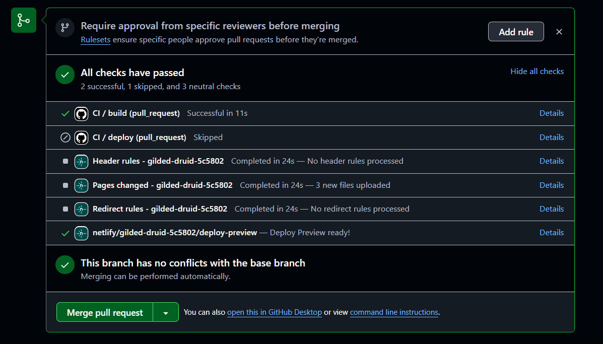


<frontmatter>
  title: "{{ title | safe }}"
  pageNav: 3
</frontmatter>



<h1 class="display-4"><md>{{ title }}</md></h1>

<div id="section-setting-up">

<box type="warning" seamless>

Note that Netlify has a low limit for free tier users (only 300 _build minutes_ per month as at June 2020 -- a single report generation can take 2-3 build minutes, longer if your report includes many/big repositories). Due to this, we will not be supporting this method going forward.
</box>

<!-- ==================================================================================================== -->

## Setting up

{{ step(1) }} **Fork the _publish-RepoSense_ repository** using this [link](https://github.com/RepoSense/publish-RepoSense/fork). Optionally, you can rename the fork to match your RepoSense report e.g., `project-code-dashboard`.

   <box type="info" seamless>

   This fork holds the Netlify build specification and the scripts that fetch and run RepoSense.
   </box>

{{ step(2) }} **Set up Netlify for your fork** as described in this [guide](https://www.netlify.com/blog/2016/09/29/a-step-by-step-guide-deploying-on-netlify/).<br>
   ==You don't need to follow `Step 5: Configure Your Settings` as we have provided you with a self-configured build script==:
   * Ensure that the following `netlify.toml` is in your main _publish-RepoSense_ repository:
   ```toml
   [build]
    command = """
    wget https://download.java.net/java/ga/jdk11/openjdk-11_linux-x64_bin.tar.gz &&
    tar -xvzf openjdk-11_linux-x64_bin.tar.gz &&
    mv jdk-11 ~/openjdk11 &&
    export JAVA_HOME=$HOME/openjdk11 &&
    export PATH=$JAVA_HOME/bin:$PATH &&
    pip install requests && ./run.sh
    """

    publish = "./reposense-report"
    base = "./"
   ```

   This build script:
   * Downloads a Java JDK, extracts and installs the JDK
   * Sets Java environment variables
   * Installs Python packages that helper script uses
   * Runs `run.sh` script to fetch RepoSense and generate the report
   * Publishes the generated `reposense-report` folder to your Netlify site

   You can customise this script to:
   * Use a different Java version by replacing the JDK download link
   * Add extra Python dependencies

   When Netlify finishes building, you’ll see a dummy report at your site URL.

{{ step(3)}} **Generate the report you want** by updating the settings in your fork.

   1. Open the `run.sh` file of your `publish-RepoSense` fork.

   ```toml
   #!/bin/bash

   # Downloads a specific version of RepoSense.jar of your choice from our repository
   ## Examples of supported options:
   ### ./get-reposense.py --release               # Gets the latest release (Stable)
   ### ./get-reposense.py --master                # Gets the latest master (Beta)
   ### ./get-reposense.py --tag v1.6.1            # Gets a specific version
   ### ./get-reposense.py --latest v1.6           # Gets the latest version with the given tag prefix e.g. v1.6.1
   ### ./get-reposense.py --commit abc123         # Gets a specific commit
   ### ./get-reposense.py --release --overwrite   # Overwrite RepoSense.jar, if exists, with the latest release

   ./get-reposense.py --release

   # Executes RepoSense
   # Do not change the default output folder name (reposense-report)
   ## Examples of other valid options; For more, please view the user guide
   ### java -jar RepoSense.jar --repos https://github.com/reposense/RepoSense.git

   java -jar RepoSense.jar
   ```

   1. Update the last line (i.e., the command for running RepoSense) to match the report you want to generate:<br>
      `java -jar RepoSense.jar --repos FULL_REPO_URL` (assuming you want to generate a default report for just one repo)<br>
     e.g., `java -jar RepoSense.jar --repos https://github.com/reposense/RepoSense.git` (==note the .git at the end of the repo URL==)
   1. Commit the file. This will trigger Netlify to rebuild the report.
   1. Go to the URL of your Netlify site to see the updated RepoSense report.
</div>

<!-- ==================================================================================================== -->

<div id="section-pr-previews">

## PR previews

Every PR to your `publish-RepoSense` repo auto-builds a preview report. On the PR page, under `All checks have passed`, find `deploy/netlify — Deploy preview ready!` and click on `Details` to see a preview of the report. This lets you review changes before merging.


</div>

<!-- ==================================================================================================== -->

## Updating the report

**Manual:** From the Netlify UI, trigger a manual rebuild. This reruns your build script with the current settings.


**Automated:** Netlify can be set up to rebuild the report whenever a target repo changes.

1. In Netlify, go to **Project configuration** at the sidebar, select **Build & deploy** from the left panel and scroll to **Build hooks**.
   
   
1. Click **Add build hook**, name your webhook, and choose the `master` branch to build. Copy the generated Netlify build hook URL.
1. Go to your GitHub target repository (the repository you want to analyze) and click on **Settings**.
1. Select **Webhooks** on left panel and click on **Add webhook**.
   
1. Paste the Netlify build hook URL inside Payload URL.
   
   <box type="info" seamless>

   Note: Although the build url is not that secretive, it should be kept safe to prevent any misuse.
   </box>
1. Select **application.json** as content type.
1. Select **Let me select individual events** and based on your requirements, check the checkboxes.
1. Leave the **Active** checkbox checked.
1. Click on **Add webhook** to save the webhook and add it.

When selected events occur in the target repository, GitHub will send a POST request to Netlify’s hook URL, triggering an automatic rebuild of your report.
