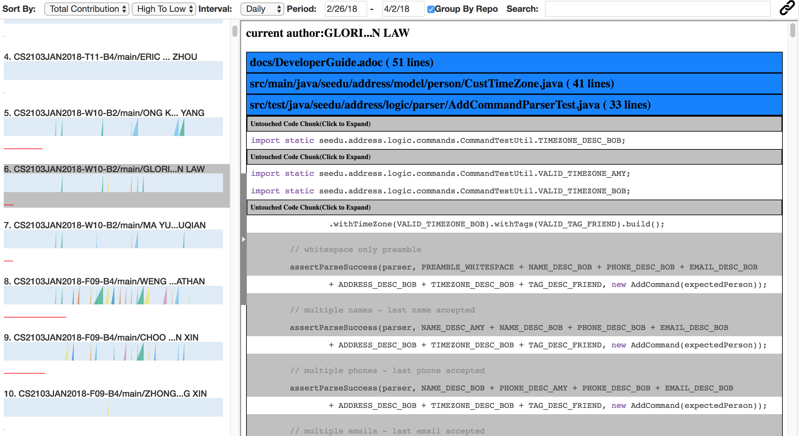

## Quick Start
1. Check [dependencies](#dependencies)
2. Fill the CSV [config file](#csv-config-file)
3. Generate the [dashboard](#how-to-generate-dashboard)
4. Profit!

## Dependencies
1. **JDK `1.8.0_60`**  or later
2. **Git** on the command line
   * Ensure that you're able to use it on the OS terminal.

## How to Generate Dashboard
1. Download the latest executable Jar on our [release](https://github.com/reposense/RepoSense/releases/latest).
   * Alternatively, you can compile the executable Jar yourself by following our [build from source guide](Build.md).
2. Execute it on the OS terminal. <br>
Usage: `java -jar RepoSense.jar -config CSV_CONFIG_FILE_PATH [-output OUTPUT_DIRECTORY] [-since DD/MM/YYYY] [-until DD/MM/YYYY]`
3. The dashboard can be in the folder designated in OUTPUT_DIRECTORY, or current working directory otherwise, as index.html.

Sample usage:
```
$ java -jar RepoSense.jar -config CSV_path.csv -output output_path/ -since 01/10/2017 -until 01/11/2017
```
Argument List:
- config: Mandatory. The path to the CSV config file.
- output: Optional. The path to the dashboard generated. If not provided, it will be generated in the current directory.
- since : Optional. start date of analysis. Format: dd/MM/yyyy
- until : Optional. end date of analysis. Format: dd/MM/yyyy


## CSV Config File
The CSV Config files control the list of target repositories. It also contains a white list of authors(if the author is listed in the CSV, his/her contribution will be ignored by the analyzer.)
[Sample_full.csv](../sample_full.csv) in root is an example CSV config file. It should contain the following columns:

Column Name | Explanation
----------- | -----------
Organization | Organization of the target repository
Repository | Name of the target repository
branch | Target branch
StudentX's Github ID | Author's Github ID.
StudentX's Display Name | Optional Field. The value of this field, if not empty,will be displayed in the dashboard instead of author's Github ID.
StudentX's Local Author Name | Detailed explanation below

## Preparation of Repositories
### Local Git Author Name
First, what is Git Author Name?

Git Author Name refers to the customizable Git Author Display Name set in local .gitconfig file. It will be displayed as Author name and Committer Name in Git. For example, in Git Log output:
```
...
commit cd7f610e0becbdf331d5231887d8010a689f87c7
Author: fakeAuthor <ma.tanghao@dhs.sg>
Date:   Fri Feb 9 19:14:41 2018 +0800

    moved

commit e3f699fd4ef128eebce98d5b4e5b3bb06a512f49
Author: harryggg <ma.tanghao@dhs.sg>
Date:   Fri Feb 9 19:13:13 2018 +0800

    new
 ...
```
*fakeAuthor* and *harryggg* are both Local Git Author Name.

RepoSense assumes that authors' local Author Name is identical as their Github ID. However, it is not always the case. Many Git users will customize their local author name. Authors can use the following command to set the their local author name to Github ID before contributing:
```
git config --global user.name “YOUR_GITHUB_ID_HERE”
```
If an author's local Git Author Name is not the same as his Github ID, he needs to fill in their local Author Name in the CSV config file. If more than one local Author Name is used, they can separate them with semicolon (；)

### Contribution Tags
Although RepoSense's contribution analysis is quite accurate, authors can still use annotations to make sure that RepoSense correctly recognize their contribution. Special thanks to [Collate](https://github.com/se-edu/collate) for providing the inspiration for this functionality.

There are 2 types of tags: Start Tags (@@author YOUR_GITHUB_ID) and End Tags(@@author). Below are some examples (stolen from Collate's User Guide):


 


You can use start tags to mark the start of your contribution. The author specified in the start tag will be recognized by RepoSense as the author for all lines between a start tag and the next end tag. If RepoSense cannot find a matching End Tag for a Start Tag in the same file, it will assume that all lines between the Start Tag to the end of the file is authored by the author specified in the Start Tag.


## Dashboard

The dashboard is written in HTML and Javascript, so you can easily publish and share it. Below is what the Dashboard looks like:



It is consisted of three main parts: tool bar, Chart Panel and Code Panel.
### Tool Bar

The tool bar at the top provides a set of filters that control the chart panel. From right to left, the filters are:
- Sorting: Users can sort by:
	- Total Contribution: the amount of lines written by the author did in the latest version of the project
	- Variance: The variance of contribution of all commits. This indicates whether the author is contributing regularly or just rushing before deadlines and milestones. This can be useful for instructors of student projects, e.g. CS2103
	- Author Name
	- Team Name: The name of the organization of the repository
- Interval: Interval refers to amount of time one single ramp represents. Users can choose two modes of time intervals: weekly (7 days)  and daily (1 day).
- Period: The time period that the ramp charts display.
- Group By Repo: Checkbox. If checked, the author that contributed to the same repo will be displayed next to each other, no matter what the sorting element is.
- Search: Only display the author whose name or the repository’s name match the keyword. The user can separate keywords by spaces, and the keywords are logically connected with OR operators.
- Bookmarking: By clicking the hyperlink icon on the top right corner, a link to the report with all the tooltip settings will be generated and copied to user’s clipboard.

### Chart Panel
The chart panel contains two types of charts: ramp charts and total contribution bars. The length of the red bars is proportional to the total contribution of the author. If the author contributes ‘too much’ compared to other authors in the report, there will be multiple red bars for him. If the user hovers on the bar, the exact amount of contribution will be shown.
#### Ramp Chart
To illustrate frequency and amount of contribution in the same graph, and also allow easy comparison between we created a new type of visualization. We call it Ramp Charts. Here are some examples of the Ramp graphs:


Each light blue bar represents the contribution timeline of an individual author for a specific repository. On each row, there are several ‘ramps’.
- The area of the ramp is proportional to the amount of contribution the author did at that time period.
- The position of the right edge of the ramp (perpendicular to the blue bar) is dependent on the time period that ramp represents.
- To make comparison between two authors easier, the color of the ramps that represent different authors' contributions at the same time period are the same.
- The timelines (blue bar) of the charts should be aligned, so that the comparison of contribution between two authors are easier.
- There is no limit to the area of the ramp. If the contribution for a time period is too large compared to the rest of the time period, it is going to overlap with the neighbor ramps. Thus, the ramps are transparent, so they will not cover their neighbors.
- As Figure shown, when the user hovers the mouse above a ramp, the time period and the exact amount of contribution will be shown.
- If you click on a ramp, a github page containing the commits in that period of time will be opened

### Code Panel
The Code Panel allows the instructors to review students' code in the report, and easily maps a line to its author.
If the user clicks on the name of the author in the visualizations of Chart Panel, the Code Panel will slide from right.

Below is the list of features in this panel:
- All files that contain author's contribution will be shown in this panel. The file that contains more lines written by the author will be shown on the top.
- After the user has reviewed a file, he can click the title of the file to hide it.
- The user can click the title again to display the file content.
- The lines that are NOT written by the current author will be marked gray, but they will still be displayed to provide context for the user
- Segments of codes that are not written by the current author is default to be collapsed. If the user wants to refer to it, he can open the segment.
